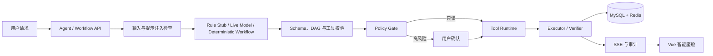

# RoadMind Agent

[](https://github.com/fanhualuoxianting/roadmind-agent/actions/workflows/ci.yml)


RoadMind Agent 是一个面向“人—车—家”协同出行场景的任务型 Agent 工程项目。大模型只负责生成**候选计划**；工具白名单、参数校验、风险分级、用户确认、执行、结果回查和审计全部由服务端控制。

> 本项目用于工程实践与求职展示，与小米汽车或其他汽车厂商无官方关联，不连接真实车辆，也不执行真实车辆控制。

## 实际运行效果

下面的截图来自本地真实启动后的 Agent 工作台，不是设计稿。


## 为什么值得看

| 工程问题 | RoadMind 的处理方式 |
| --- | --- |
| 模型会不会乱调用工具 | 工具白名单、严格 JSON 输入、Bean Validation、调用数量上限和未知工具拒绝 |
| 高风险动作谁来批准 | 服务端 Policy Gate 分级，确认绑定计划版本与 payload hash，模型不能自我授权 |
| 外部服务失败怎么办 | 明确的 Live/Stub 来源标记、超时、有限重试、Circuit Breaker、Bulkhead 和稳定错误码 |
| 重启后任务会不会消失 | MySQL 事实源、用户隔离 Redis 投影、任务快照、终态 SSE 重建和事务 Outbox |
| 多用户数据会不会串 | 会话、Agent 任务、Core Workflow 与 Trip 都校验资源归属，Redis 降级数据同样绑定用户 |
| 怎么证明不是“只会演示” | Maven/Vitest 自动化测试、30 条离线评测、GitHub Actions 和可复现验证脚本 |

## 两条受控执行链路

RoadMind 没有把所有能力混成一个“万能 Agent”。当前实现明确区分两条链路：

1. **异步只读 Agent**：`/agent` 使用 `RULE_STUB` 或 Spring AI `LIVE_MODEL` 选择三个注册只读工具，并通过 SSE 返回工具时间线和最终响应。
2. **可确认工作流**：`/plan` 使用服务端版本化 DAG 处理车辆预热和家居控制等写操作；高风险步骤必须绑定计划版本、确认 ID 和参数摘要后才能执行或延后调度。



## 核心能力

### Agent 与安全执行

- `RULE_STUB` 与 Spring AI `LIVE_MODEL` 双规划入口；
- `vehicle.get_status`、`weather.get_forecast`、`route.plan` 三个强类型只读工具；
- 严格 JSON 反序列化、非法输出受限修复、16 KiB 参数上限；
- 版本化 DAG、服务端风险分级、确认绑定和 Verifier 回查；
- 用户隔离的会话、Agent 任务、Workflow、Trip 与 Redis 投影；
- 提示注入信号、审计脱敏、原子固定窗口限流和 SSE 连接上限；
- Agent 与工具执行队列都设置硬容量，过载时返回稳定错误而不是无限占用内存；
- 受令牌保护的独立 MCP 只读桥，不能绕过主服务 Policy Gate。

### 出行数字孪生

- 独立车辆模拟器与单车单写者 Trip Engine；
- start / pause / resume / cancel 与 1× / 5× / 20× 倍速；
- 路线版本、遥测序列、ETA、电量消耗和低电量重规划；
- SSE 重放、`Last-Event-ID`、心跳、乱序去重和超窗快照；
- 高德路线/天气 Live 适配器，以及 Key 缺失时明确标注的 Stub/降级视图。

### 持久化与可靠性

- Flyway V1–V10、MySQL 事实源与 Redis 缓存/协调层；
- 对话上下文、Agent 任务、Workflow、Trip、偏好和定时任务恢复；
- MySQL 暂时不可用时，已有用户隔离会话与 Agent 任务可从 Redis 投影恢复；
- 重启前未完成的 Agent 任务会明确转为 `AGENT_RESTARTED`；
- `Idempotency-Key` 重放与参数冲突检测；
- Trip 事务 Outbox、任务租约恢复和跨用户资源隔离；
- Resilience4j Retry、Circuit Breaker 与 Bulkhead。

## 仓库结构

```text
roadmind-agent/
├─ roadmind-server/       # Agent、Workflow、Trip、持久化、安全与审计
├─ vehicle-simulator/     # 车辆和家居数字孪生
├─ roadmind-mcp-server/   # 受令牌保护的无状态 MCP 只读适配层
├─ roadmind-web/          # Vue 3 智能座舱前端
├─ roadmind-evaluation/   # 30 条离线评测 fixture 与运行器
├─ docs/                  # 当前架构、运行截图和 MCP 说明
├─ scripts/               # 本地验证脚本
└─ docker-compose.yml     # MySQL + Redis
```

## 快速启动

### 环境要求

- JDK 21
- Docker Desktop / Docker Compose v2
- Node.js 24 与 npm 11
- Git

Maven 使用仓库内 Wrapper，不要求全局安装 Maven。

### 1. 准备配置

```powershell
Copy-Item .env.example .env
notepad .env
```

替换 `.env` 中的本地 MySQL 与 Redis 密码。默认模式是 `RULE_STUB + STUB`，不需要模型 Key 或高德 Key。

### 2. 启动基础设施

```powershell
docker compose up -d
docker compose ps
```

### 3. 加载环境变量

```powershell
Get-Content .env |
  Where-Object { $_ -match '^[^#][^=]*=' } |
  ForEach-Object {
    $name, $value = $_.Split('=', 2)
    Set-Item -Path "Env:$name" -Value $value
  }
```

### 4. 启动应用

```powershell
# 窗口 1：车辆数字孪生
.\mvnw.cmd -pl vehicle-simulator spring-boot:run

# 窗口 2：主服务（仅本地 demo 认证）
.\mvnw.cmd -pl roadmind-server spring-boot:run "-Dspring-boot.run.profiles=demo"

# 窗口 3：前端
npm --prefix .\roadmind-web ci
npm --prefix .\roadmind-web run dev
```

浏览器打开 `http://localhost:5173`。

| 页面 | 用途 |
| --- | --- |
| `/agent` | 异步只读 Agent 与工具时间线 |
| `/plan` | 版本化计划与高风险确认 |
| `/trip` | 实时行程、地图、遥测和控制 |
| `/vehicle` | 车辆数字孪生状态 |
| `/automation` | 偏好与持久化定时任务 |

## 运行模式

| 配置 | 含义 |
| --- | --- |
| `ROADMIND_AGENT_MODE=RULE_STUB` | 确定性规则规划，适合零 Key 演示与回归测试 |
| `ROADMIND_AGENT_MODE=LIVE_MODEL` | 使用 Spring AI `ChatModel` 生成候选只读工具计划 |
| `WEATHER_MODE=STUB/LIVE` | 天气数据来源 |
| `ROUTE_MODE=STUB/LIVE` | 路线数据来源 |

### OpenAI 兼容模型

```dotenv
ROADMIND_AGENT_MODE=LIVE_MODEL
SPRING_AI_MODEL_CHAT=openai
OPENAI_API_KEY=your-local-key
OPENAI_BASE_URL=https://your-openai-compatible-endpoint.example
OPENAI_MODEL=your-model-name
```

模型配置失败时，任务以 `MODEL_UNAVAILABLE` 结束；系统不会静默伪装成模型成功。

### 可选 MCP 服务

```powershell
$env:ROADMIND_INTERNAL_TOKEN = "replace-with-a-long-random-token"
$env:ROADMIND_MCP_TOKEN = $env:ROADMIND_INTERNAL_TOKEN
$env:ROADMIND_SERVER_BASE_URL = "http://127.0.0.1:8080"
.\mvnw.cmd -pl roadmind-mcp-server spring-boot:run
```

MCP 端点为 `POST /mcp`，只暴露三个只读工具。高风险写操作不会通过 MCP 暴露。

## 验证

Windows PowerShell：

```powershell
.\scripts\verify-project.ps1
```

跨平台核心检查：

```bash
./mvnw -B -ntp verify
npm --prefix roadmind-web ci
npm --prefix roadmind-web run test -- --run
npm --prefix roadmind-web run build
python roadmind-evaluation/run_evaluation.py --output roadmind-evaluation/reports/local.json
python -m unittest discover -s roadmind-evaluation -p 'test_*.py'
```

当前 CI 基线覆盖 111 个后端测试、前端测试与生产构建、30 条离线 Agent 评测、Compose 配置检查和敏感信息扫描。生成的评测报告位于被 Git 忽略的 `roadmind-evaluation/reports/`。

## 设计边界

- 车辆、家庭设备、位置和遥测均为数字孪生或 Stub；
- `demo` Profile 只允许本机回环地址自动登录，不能作为生产认证方案；
- MySQL 是事实源，Redis 是用户隔离的缓存与短期降级恢复投影；
- 离线评测验证确定性基线与安全规则，不代表任意真实模型的通用质量；
- 未实现真实厂商车控、多租户 SaaS、生产级密钥托管或公网 MCP 托管。

## 文档

- [当前系统架构](docs/architecture.md)
- [MCP 集成说明](docs/mcp-integration.md)
- [离线评测说明](roadmind-evaluation/README.md)
- [安全问题报告策略](SECURITY.md)

## License

[MIT](LICENSE)
