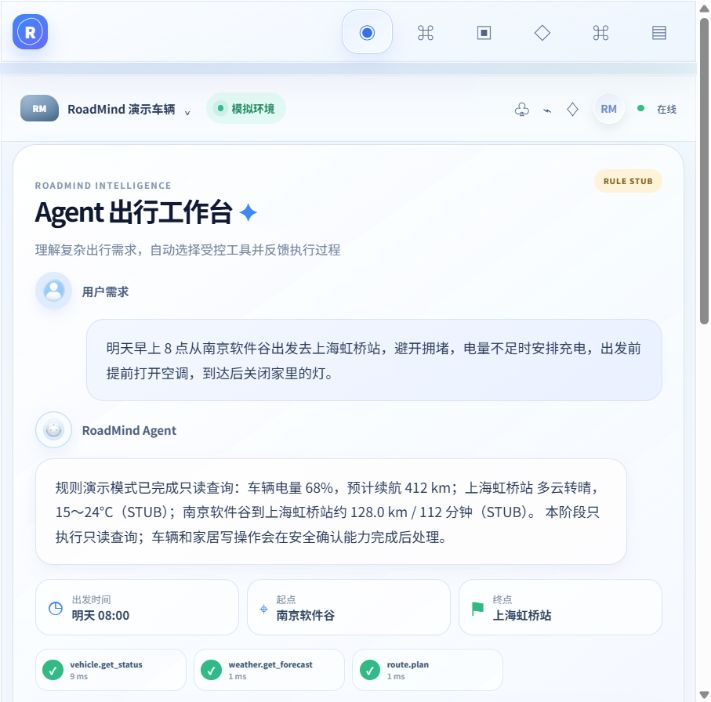

# RoadMind Agent

RoadMind Agent 是一个面向“人—车—家”协同出行场景的任务型 Agent 工程项目。它的目标不是复刻聊天机器人，而是展示可解释规划、受控工具执行、风险确认、结果验证、数字孪生与审计等完整工程链路。

> **重要说明**
> 本项目为智能座舱 Agent 工程演示项目，与小米汽车及其他汽车厂商无官方关联。车辆控制、车辆位置和车辆状态均通过数字孪生模拟服务实现。

## 运行效果

以下截图来自本地实际运行中的 RoadMind Agent 工作台：



当前仓库已覆盖阶段 0–8 的实现主线：阶段 5 补齐车辆原生定时命令、高风险延后授权、家居数字孪生、Trip 事务 Outbox 与重启恢复；阶段 6 提供独立、令牌保护的 MCP 只读工具桥；阶段 7 提供 Resilience4j、Redis 优先限流、本地降级、提示注入拦截、审计脱敏、SSE 连接上限和资源归属校验；阶段 8 提供 30 条离线 RULE_STUB 评测、CI 和本地验证脚本。车辆和家庭设备仍是数字孪生演示，不执行真实厂商控制。

## 当前可见能力

- 固定数字孪生车辆 `demo-vehicle-001`；
- 完整车辆状态查询；
- 电量与车内温度白名单修改；
- 单调 `stateVersion` 和乐观版本检查；
- `Idempotency-Key` 重放与参数冲突检测；
- 统一 API 响应、稳定错误码和 `traceId`；
- Simulator 离线时 Server 明确返回 503，不伪造车辆状态；
- 仅在 `demo` Profile 注册的状态修改入口；
- 会话 Cookie + CSRF 浏览器安全基线；
- Flyway 阶段 1 最小迁移；
- `vehicle.get_status`、`weather.get_forecast`、`route.plan` 三个只读工具；
- 工具名称唯一性、严格 JSON 输入、Bean Validation、16 KiB 参数上限、超时与有限重试；
- Spring AI 1.1.8 `ChatModel` Live 入口；无 Key 时显式 `RULE_STUB`，不冒充模型规划；
- 天气和路线支持 `LIVE` / `STUB` 双适配，响应始终携带来源模式；
- 会话、异步 Agent 任务、幂等冲突检测和基础 SSE 生命周期；
- 模型非法 JSON 只允许一次受限修复，未知工具在执行前拒绝；
- 已锁定视觉体系的 Vue 3 Agent 工作台，以及原有车辆数字孪生状态页。
- 多轮槽位覆盖、版本化 DAG、服务端 Policy Gate、确认绑定与 Verifier 回查；
- GCJ-02 路线归一化、路线 hash / routeVersion 与高德完整折线 Live 适配器；
- 模拟器单车单写者 Trip Engine：start、pause、resume、cancel、1×/5×/20×；
- 按累计距离二分定位的平滑位置事实、heading、电量、ETA 与单调 telemetry sequence；
- 行程 SSE 的重放、`Last-Event-ID`、超窗快照、心跳和前端乱序去重；
- 低电量只触发一次充电重规划，路线升级为新版本；
- 高德 JS API 明亮底图适配；Key 缺失或加载失败时使用明确标注的降级视图；
- 实时行程 UI：剩余里程、电量、到达电量、推荐充电、暂停/继续/取消和倍速。
- MySQL 分类偏好：过期过滤、软删除和地点别名展开；
- Redis 会话上下文缓存，Redis 清空后从 MySQL 恢复；
- 持久化普通提醒：到期领取、租约恢复、取消和幂等冲突；
- Agent 任务快照：状态、目标、结果和请求 hash 可在服务重启后恢复；
- Agent 任务 Redis 投影：任务快照与请求幂等 hash 分开缓存，数据库不可用时才作为后备；
- Core Workflow 快照：版本化计划、风险确认摘要、时间线和过期状态可在服务重启后恢复；
- Core Workflow Redis 投影：活跃槽位、待确认摘要和 workflow 索引按独立 TTL 缓存；
- Trip 当前快照：路线版本、最新遥测和低电量重规划标志可在服务重启后恢复；
- `/automation` 偏好与提醒管理页，明确展示 MySQL 事实源与 Redis 回源能力。
- 车辆原生预热调度、绑定原始确认快照的高风险延后家居动作，以及 Trip 事务 Outbox；
- 独立 `roadmind-mcp-server`：MCP 初始化、工具列表、令牌保护和三项只读工具桥接；
- Redis 优先固定窗口限流、本地故障降级、Resilience4j 外部依赖隔离、提示注入风险信号和脱敏审计；
- Trip 新建资源的用户归属与重启后的查询/命令/SSE 归属校验；
- `roadmind-evaluation` 30 条可复现离线用例与 `/scripts/verify-project.ps1` 验证入口；

当前运行适配仍有部分进程内存状态；MySQL 是事实源，Redis 是缓存和协调层。Flyway V1→V9、阶段 5–8 的证据见 [`docs/phase5-validation.md`](docs/phase5-validation.md) 和 [`docs/phase6-8-validation.md`](docs/phase6-8-validation.md)。

## 仓库结构

```text
roadmind-agent/
├─ roadmind-server/       # 唯一业务后端和对外 API
├─ vehicle-simulator/     # 独立车辆数字孪生进程
├─ roadmind-mcp-server/   # 受令牌保护的 MCP 协议适配层
├─ roadmind-web/          # Vue 3 智能座舱前端
├─ roadmind-evaluation/   # 离线评测用例与报告生成器
├─ docs/                  # 阶段 0 架构与开发基线
├─ docker-compose.yml     # MySQL + Redis
├─ pom.xml                # Maven 聚合根工程
└─ README.md
```

## 技术基线

| 组件 | 版本 |
| --- | --- |
| Java | 21 LTS |
| Maven Wrapper | Maven 3.9.16 / Wrapper 3.3.4 |
| Spring Boot | 3.5.16 |
| MyBatis-Plus | 3.5.17 |
| Spring AI | 1.1.8 |
| Resilience4j | 2.3.0 |
| Testcontainers | 2.0.5 |
| MySQL | 8.4.11 |
| Redis | 8.10.0 |
| Vue / Vue Router / Pinia | 3.5.40 / 5.2.0 / 4.0.2 |
| Vite / TypeScript | 8.2.0 / 5.9.3 |

Spring AI 已在阶段 2 接入，MCP 只做协议适配；实际工具执行仍强制经过 RoadMind 自有工具运行时和 Policy Gate，不允许模型或 MCP 客户端直接授权或执行高风险写操作。

## Windows PowerShell 环境检查

```powershell
java --version
node --version
npm --version
docker version
docker compose version
git --version
```

要求 JDK 21、Node 24.19.0+、npm 11.19.0+、Docker Desktop/Compose v2 和 Git。Maven 使用仓库内 Wrapper，无需全局安装。

## 第一次启动

### 1. 创建本地环境文件

```powershell
Copy-Item .env.example .env
notepad .env
```

请把 `.env` 中三个 `replace-with-...` 替换成仅用于本机开发的随机密码。`.env` 已被 Git 忽略。默认的 `RULE_STUB + STUB` 不需要模型或高德 Key，并会在页面与 API 中明确标注来源。

### 2. 启动 MySQL 与 Redis

```powershell
docker compose config
docker compose up -d
docker compose ps
```

### 3. 将 `.env` 加载到当前 PowerShell

```powershell
Get-Content .env |
  Where-Object { $_ -match '^[^#][^=]*=' } |
  ForEach-Object {
    $name, $value = $_.Split('=', 2)
    Set-Item -Path "Env:$name" -Value $value
  }
```

### 4. 启动车辆模拟器

新建一个 PowerShell 窗口：

```powershell
.\mvnw.cmd -pl vehicle-simulator spring-boot:run
```

模拟器默认只绑定 `127.0.0.1:8081`，浏览器不应直接访问它。

### 5. 启动 RoadMind Server

新建一个 PowerShell 窗口，先重复步骤 3 加载环境变量：

```powershell
.\mvnw.cmd -pl roadmind-server spring-boot:run "-Dspring-boot.run.profiles=demo"
```

缺少模型 Key 或高德 Key 不影响默认启动。此时 Spring AI ChatModel 被禁用，规则入口和外部数据均明确标记为 Stub。

### 6. 可选启动 MCP 服务

MCP 只读桥接不影响主 Server；令牌必须与 Server 的 `ROADMIND_INTERNAL_TOKEN` 一致：

```powershell
$env:ROADMIND_SERVER_BASE_URL = "http://127.0.0.1:8080"
$env:ROADMIND_MCP_TOKEN = "replace-with-local-mcp-token"
.\mvnw.cmd -pl roadmind-mcp-server spring-boot:run
```

无状态 MCP 端点为 `POST /mcp`，客户端应同时声明 `application/json` 与 `text/event-stream`；工具调用仍回到主 Server 的只读 ToolRuntime。

### 7. 启动前端

```powershell
npm --prefix .\roadmind-web install
npm --prefix .\roadmind-web run dev
```

浏览器打开 `http://localhost:5173`：

- `/agent`：阶段 2 Agent 出行工作台，真实消费 SSE；
- `/plan`：阶段 3 版本化 DAG、服务端风险与安全确认；
- `/trip`：阶段 4 实时行程、地图适配、遥测与控制；
- `/vehicle`：阶段 1 车辆数字孪生状态页。
- `/automation`：阶段 5 偏好与持久化普通提醒管理页。

Vite 只代理 `/api` 到 `roadmind-server`，不会直接连接模拟器。

## 模型与外部服务模式

### 安全默认模式

```dotenv
ROADMIND_AGENT_MODE=RULE_STUB
SPRING_AI_MODEL_CHAT=none
WEATHER_MODE=STUB
ROUTE_MODE=STUB
```

规则引擎仅识别固定演示意图，三项工具仍经过与 Live 模式相同的注册、参数校验、超时和事件链路。所有 Stub 响应都有 `sourceMode=STUB` 和免责声明。

### OpenAI 兼容模型 Live 模式

```dotenv
ROADMIND_AGENT_MODE=LIVE_MODEL
SPRING_AI_MODEL_CHAT=openai
OPENAI_API_KEY=your-local-key
OPENAI_BASE_URL=https://your-compatible-endpoint.example
OPENAI_MODEL=your-model-name
```

不要把 Key 写入 `application.yml` 或提交 Git。Live 模型只能提出三个注册只读工具的候选调用；未知工具、超量工具和非法参数仍由服务端拒绝。若启用 `LIVE_MODEL` 却没有可用 `ChatModel`，任务以 `MODEL_UNAVAILABLE` 结束，不会静默切换并伪造模型结果。

### 高德天气与路线 Live 模式

```dotenv
WEATHER_MODE=LIVE
ROUTE_MODE=LIVE
AMAP_WEB_SERVICE_KEY=your-local-amap-web-service-key
```

Live 响应标记为 `sourceMode=LIVE`。Key 缺失、地点无法解析或外部响应无效时返回稳定工具错误；不会回填成“天气良好”或把 Stub 路线显示为实时路线。

浏览器高德底图还需要独立的 JS API Key 和安全密钥；它们只写入本机 `.env`：

```dotenv
VITE_AMAP_JS_KEY=your-browser-key
VITE_AMAP_SECURITY_CODE=your-security-code
```

未配置或加载失败时，`/trip` 会显示路线摘要、进度和遥测降级视图，并持续标明它不是真实底图。

## 阶段 4 行程 HTTP 闭环

在 Simulator 与 Server 启动后，通过 `/trip` 可直接创建固定演示行程。也可用 PowerShell 验收：

```powershell
$web = New-Object Microsoft.PowerShell.Commands.WebRequestSession
$csrf = Invoke-RestMethod -Uri "http://localhost:8080/api/v1/security/csrf" -WebSession $web
$headers = @{ "X-XSRF-TOKEN" = $csrf.data.token; "Idempotency-Key" = [guid]::NewGuid().ToString() }
$trip = Invoke-RestMethod -Method Post -Uri "http://localhost:8080/api/v1/trips" `
  -WebSession $web -Headers $headers -ContentType "application/json" `
  -Body '{"origin":"南京软件谷","destination":"无锡学院","avoidTraffic":true,"initialBatteryPercent":42}'
$headers["Idempotency-Key"] = [guid]::NewGuid().ToString()
Invoke-RestMethod -Method Post -Uri "http://localhost:8080/api/v1/trips/$($trip.data.tripId)/commands" `
  -WebSession $web -Headers $headers -ContentType "application/json" `
  -Body '{"action":"START","simulationSpeed":20}'
```

支持的 `action`：`START`、`PAUSE`、`RESUME`、`SET_SPEED`、`CANCEL`。重复同一幂等键与相同参数返回原结果；异参冲突返回 409。

## Agent 与 SSE 闭环验收

先按启动步骤运行 Simulator 与 Server，再执行：

```powershell
$web = New-Object Microsoft.PowerShell.Commands.WebRequestSession
$csrf = Invoke-RestMethod `
  -Uri "http://localhost:8080/api/v1/security/csrf" `
  -WebSession $web

$headers = @{
  "X-XSRF-TOKEN" = $csrf.data.token
  "Idempotency-Key" = [guid]::NewGuid().ToString()
}

$conversation = Invoke-RestMethod `
  -Method Post `
  -Uri "http://localhost:8080/api/v1/conversations" `
  -WebSession $web `
  -Headers $headers `
  -ContentType "application/json" `
  -Body '{"title":"RoadMind 演示","timezone":"Asia/Shanghai"}'

$headers["Idempotency-Key"] = [guid]::NewGuid().ToString()
$request = @{
  message = "明天早上 8 点从南京软件谷出发去无锡学院，避开拥堵，查询天气和车辆电量。"
  clientContext = @{ timezone = "Asia/Shanghai" }
} | ConvertTo-Json

$task = Invoke-RestMethod `
  -Method Post `
  -Uri "http://localhost:8080/api/v1/conversations/$($conversation.data.conversationId)/agent-requests" `
  -WebSession $web `
  -Headers $headers `
  -ContentType "application/json" `
  -Body $request

$task.data
Invoke-RestMethod `
  -Uri "http://localhost:8080/api/v1/agent-tasks/$($task.data.taskId)" `
  -WebSession $web
```

浏览器页面会通过 `EventSource` 消费：`agent.task.updated`、`agent.plan.created`、`tool.call.started`、`tool.call.completed`、`agent.response.ready` 和 `stream.complete`。

## 车辆 HTTP 闭环验收

```powershell
$web = New-Object Microsoft.PowerShell.Commands.WebRequestSession
$csrf = Invoke-RestMethod `
  -Uri "http://localhost:8080/api/v1/security/csrf" `
  -WebSession $web

$initial = Invoke-RestMethod `
  -Uri "http://localhost:8080/api/v1/vehicles/198000000000000401/status" `
  -WebSession $web

$headers = @{
  "X-XSRF-TOKEN" = $csrf.data.token
  "Idempotency-Key" = [guid]::NewGuid().ToString()
}

$body = @{
  expectedVersion = $initial.data.stateVersion
  batteryPercent = 42
  cabinTemperature = 24
} | ConvertTo-Json

$updated = Invoke-RestMethod `
  -Method Patch `
  -Uri "http://localhost:8080/api/v1/demo/vehicles/198000000000000401/state" `
  -WebSession $web `
  -Headers $headers `
  -ContentType "application/json" `
  -Body $body

$updated.data
```

重复使用相同 `Idempotency-Key` 和相同请求会返回原结果；相同 Key 但更改参数会返回 `409 IDEMPOTENCY_CONFLICT`。使用旧 `expectedVersion` 会返回 `409 VEHICLE_STATE_CONFLICT`。

## 测试与构建

```powershell
.\mvnw.cmd test
npm --prefix .\roadmind-web run type-check
npm --prefix .\roadmind-web run test -- --run
npm --prefix .\roadmind-web run build
python .\roadmind-evaluation\run_evaluation.py
python -m unittest discover -s .\roadmind-evaluation -p 'test_*.py'
```

`InfrastructureSmokeTest` 使用固定版本 MySQL/Redis Testcontainers：Docker 可用时会执行空库 Flyway 与 Redis PING；Docker 不可用时由 Testcontainers 明确跳过，不使用 H2 伪装通过。

阶段 2 还覆盖工具注册冲突、未知工具、严格输入、超时、有限重试、模型 JSON 修复、Spring AI Live 入口、模型缺失降级、高德适配契约、Agent 幂等和 SSE 顺序。详见阶段验收记录。

## 停止基础设施

```powershell
docker compose down
```

如需同时删除本地演示数据库和 Redis 数据（不可恢复）：

```powershell
docker compose down --volumes
```

## 常见问题

### Server 启动时报数据库连接失败

先运行 `docker compose ps`，确认 MySQL 为 `healthy`，再确认当前 PowerShell 已按步骤 3 加载 `.env`。

### 页面显示“车辆模拟器离线”

确认 `vehicle-simulator` 在 8081 端口运行；Server 会返回真实 503，不会用缓存状态伪造在线。

### 修改状态返回 403

浏览器需要先调用 `/api/v1/security/csrf` 建立 demo 会话并取得 CSRF Cookie。项目内 Axios 已集中完成这一流程。直接调用 API 时请参考上面的 PowerShell 示例。

### 端口被占用

在 `.env` 修改 `MYSQL_PORT`、`REDIS_PORT`、`SERVER_PORT`、`SIMULATOR_PORT` 或 `WEB_PORT`。若更改模拟器端口，同时更新 `VEHICLE_SIMULATOR_BASE_URL`。

## 文档

- [需求说明](docs/requirements.md)
- [架构设计](docs/architecture.md)
- [开发计划](docs/development-plan.md)
- [安全设计](docs/security-design.md)
- [API 草案](docs/api-draft.md)
- [数据库设计](docs/database-design.md)
- [地图与行程设计](docs/map-and-trip-design.md)
- [阶段 1 验收记录](docs/phase1-validation.md)
- [阶段 2 验收记录](docs/phase2-validation.md)
- [阶段 3 验收记录](docs/phase3-validation.md)
- [阶段 4 验收记录](docs/phase4-validation.md)
- [阶段 5 验收记录](docs/phase5-validation.md)
- [阶段 6–8 验收记录](docs/phase6-8-validation.md)
- [MCP 集成说明](docs/mcp-integration.md)

## License

[MIT](LICENSE)
