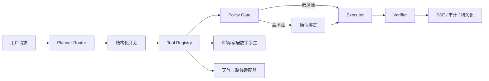

# RoadMind Agent

[](https://github.com/fanhualuoxianting/roadmind-agent/actions/workflows/ci.yml)

RoadMind Agent 是一个面向“人—车—家”协同出行场景的任务型 Agent 工程项目。它不是聊天壳，而是围绕**规划、工具、策略、确认、执行、验证、数字孪生、恢复与审计**搭建的一条可解释工程链路。

> **重要边界**
> 本项目与小米汽车及其他汽车厂商无官方关联，不接入真实车辆或真实家庭设备。车辆位置、状态、行程和控制结果均来自数字孪生模拟；离线 `RULE_STUB` 评测也不代表真实模型质量或生产性能。

<p align="center">
  
</p>

## 一个典型任务

用户可以提出：

> 明早 8 点从南京软件谷出发去上海虹桥站，先检查车辆电量和天气；如果需要预热或执行高风险动作，先给我确认；行程中持续展示位置、电量和 ETA。

RoadMind 会把请求拆成版本化计划，调用车辆、天气与路线工具，经服务端 Policy Gate 判断风险；需要确认的动作暂停等待授权，执行后由 Verifier 回查事实，并通过 SSE 持续输出任务和行程状态。

## 核心链路



## 项目亮点

### 1. 显式 Stub / Live 模式

- 默认 `ROADMIND_AGENT_MODE=RULE_STUB`，没有模型 Key 时不会冒充真实模型规划；
- `LIVE_MODEL` 使用 Spring AI 的 OpenAI-compatible `ChatModel` 入口；
- 模型只提出候选工具计划，工具注册、参数校验、风险判断和执行权限仍由主 Server 控制；
- 天气与路线同样区分 `STUB` / `LIVE`，响应携带真实来源模式。

### 2. 服务端 Policy Gate

高风险确认绑定 `workflow`、`step`、`confirmation`、`planVersion` 与 `payloadHash`。延后任务真正创建或执行前重新校验，避免计划变化、参数替换或跨用户复用一次确认。

### 3. 数字孪生与 Trip Engine

- 车辆状态使用单调 `stateVersion`、乐观版本检查和 `Idempotency-Key`；
- Trip 支持 start / pause / resume / cancel 与 1× / 5× / 20× 模拟速度；
- 基于累计距离推进位置、heading、电量和 ETA；
- 低电量只触发一次重规划，并升级 `routeVersion`；
- 模拟器离线时返回明确依赖错误，不伪造车辆事实。

### 4. SSE 与断线恢复

Agent 与 Trip 事件具有单调序号、`Last-Event-ID` 重放、超窗快照、心跳、连接上限和前端乱序去重。重连恢复依赖服务端状态与事件序号，不依赖前端“猜状态”。

### 5. MySQL / Redis 分层与 Outbox

MySQL 保存 Agent、Workflow、授权任务与 Trip 事实；Redis 用于缓存、活跃状态和限流。Trip 快照和 Outbox 事件在同一事务追加，Worker 使用租约、重试和过期租约恢复处理事件。

### 6. 只读 MCP Bridge

独立 `roadmind-mcp-server` 使用内部令牌桥接：

- `vehicle.get_status`
- `weather.get_forecast`
- `route.plan`

MCP 只做协议适配，不能绕过主 Server 的工具 Schema、参数上限、超时和策略控制，也不暴露高风险写工具。

### 7. 安全、稳定性与可复算评测

- Resilience4j 用于适合重试的只读外部依赖；
- Redis 固定窗口限流，连接异常时使用有界本地降级；
- 高信号提示注入检测与外部工具结果隔离；
- 审计字段白名单和敏感值脱敏；
- 30 条版本化离线 fixture，报告保留 cases hash、运行模式与失败明细。

更完整的代码证据、验收口径和简历对应关系见 [docs/engineering-evidence.md](docs/engineering-evidence.md)。

## 仓库结构

| 模块 | 作用 |
| --- | --- |
| `roadmind-server` | Agent、Tool Runtime、Policy Gate、Workflow、Trip、持久化、审计与 API。 |
| `vehicle-simulator` | 车辆与家居数字孪生、Trip Engine、状态与调度接口。 |
| `roadmind-mcp-server` | 令牌保护的无状态 MCP 只读工具桥。 |
| `roadmind-web` | Vue 3 智能座舱工作台、实时行程、车辆状态和任务审计界面。 |
| `roadmind-evaluation` | 30 条可复算离线 fixture 与评测运行器。 |
| `docs` | 架构、数据库、安全、地图、MCP、阶段验证和工程证据。 |
| `ui-reference` | 六张界面视觉基准，用于设计一致性参考。 |

## 技术栈

- Java 21、Spring Boot 3.5、Spring AI 1.1、MyBatis-Plus、Flyway；
- MySQL 8.4、Redis 8、Resilience4j；
- Vue 3、TypeScript、Vite、Vitest；
- Python 离线评测；
- Docker Compose、GitHub Actions。

## 快速启动：安全默认模式

环境要求：JDK 21、Node.js 24+、npm、Docker Desktop / Compose v2。

### 1. 准备本地配置

```powershell
Copy-Item .env.example .env
```

将 `.env` 中的 MySQL、Redis 和内部令牌示例值替换为本地随机值。不要提交 `.env`。

启动基础设施：

```powershell
docker compose up -d
docker compose ps
```

启动 Java 进程前，在当前终端配置与 `.env` 相同的数据库 / Redis 变量。默认 Agent、天气和路线仍使用 Stub，不需要模型或高德 Key。

### 2. 启动车辆模拟器

```powershell
.\mvnw.cmd -pl vehicle-simulator spring-boot:run
```

默认地址：`http://localhost:8081`。

### 3. 启动主 Server

```powershell
.\mvnw.cmd -pl roadmind-server spring-boot:run
```

默认地址：`http://localhost:8080`，健康检查：`/actuator/health`。

### 4. 启动前端

```powershell
cd roadmind-web
npm ci
npm run dev
```

默认地址：`http://localhost:5173`。

## 启用 Live Model 或高德适配

只有在确认安全边界后，才在本机环境变量中设置：

```text
ROADMIND_AGENT_MODE=LIVE_MODEL
SPRING_AI_MODEL_CHAT=openai
OPENAI_API_KEY=本地密钥
OPENAI_BASE_URL=兼容接口地址
OPENAI_MODEL=模型名

WEATHER_MODE=LIVE
ROUTE_MODE=LIVE
AMAP_WEB_SERVICE_KEY=本地高德 Web Service Key
```

模型仍不能直接执行工具；所有候选调用继续经过 Tool Runtime、Policy Gate、确认和 Verifier。任何 Key 都不得写入 Git、截图、日志或评测报告。

## 验证

```powershell
# Java 模块
.\mvnw.cmd -B clean test

# 前端
cd roadmind-web
npm ci
npm run type-check
npm run test -- --run
npm run build

# 离线评测
cd ..
python .\roadmind-evaluation\run_evaluation.py
python -m unittest discover -s .\roadmind-evaluation -p 'test_*.py'

# Windows 统一入口
.\scripts\verify-project.ps1
```

GitHub Actions 覆盖 Maven 测试、前端类型检查 / 测试 / 构建、离线评测和基础 secret scan。历史具体测试数量与 fixture 延迟见带日期的验证记录；简历中只应使用当前分支重新运行后的数字。

## 文档

- [工程证据与验收口径](docs/engineering-evidence.md)
- [系统架构](docs/architecture.md)
- [数据库设计](docs/database-design.md)
- [安全设计](docs/security-design.md)
- [地图与行程设计](docs/map-and-trip-design.md)
- [MCP 集成](docs/mcp-integration.md)
- [阶段 5 验证记录](docs/phase5-validation.md)
- [阶段 6–8 验证记录](docs/phase6-8-validation.md)
- [Codex 接力清单](docs/CODEX_HANDOFF.md)

## 当前限制

- 不连接真实车辆、家庭设备或厂商账号；
- 没有公开在线 Demo；
- Live Model 与高德 Live 模式需要用户自行提供接口和密钥；
- 家居数字孪生状态尚未完整持久化；
- MCP 目前只开放三项只读工具；
- 离线 fixture 不是模型 Benchmark；
- 尚未公开多实例压测、长时间稳定性、生产 SOC / SIEM / HSM 或自动发布证据；
- `qa-artifacts` 仍保留部分历史 UI 对比图片，后续应只保留最终展示素材。

剩余优化和严格验收步骤见 [docs/CODEX_HANDOFF.md](docs/CODEX_HANDOFF.md)。

## License

MIT，见 [LICENSE](LICENSE)。
