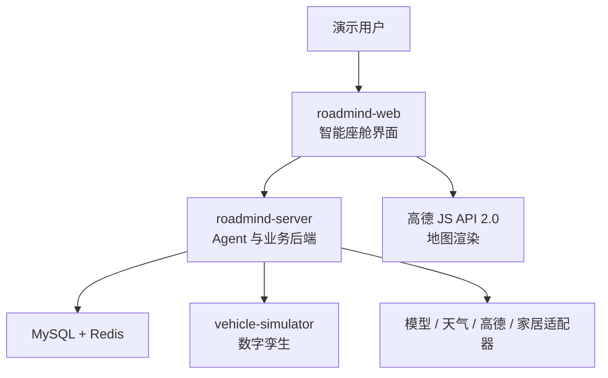
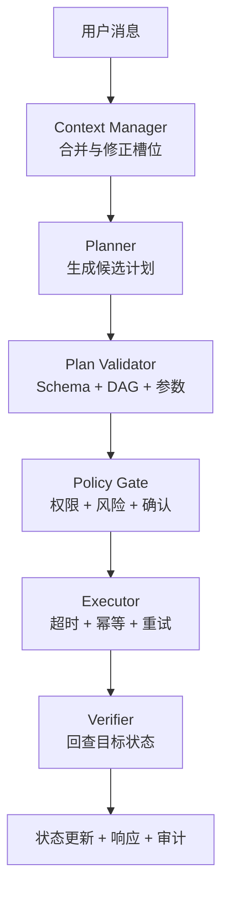
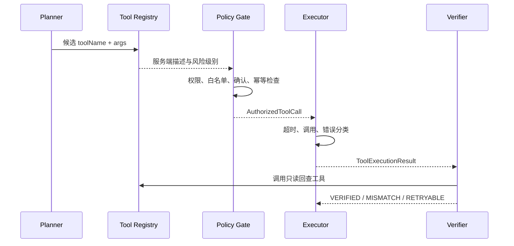
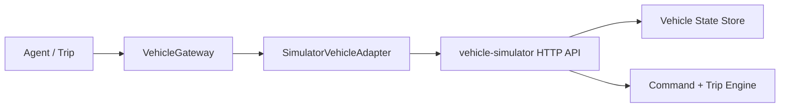
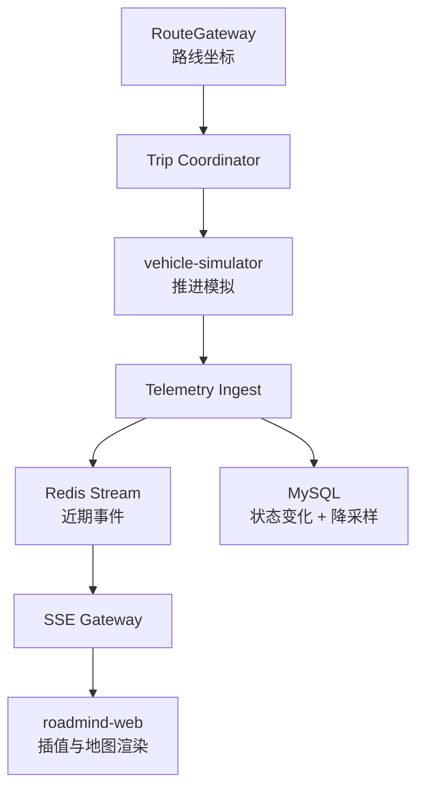
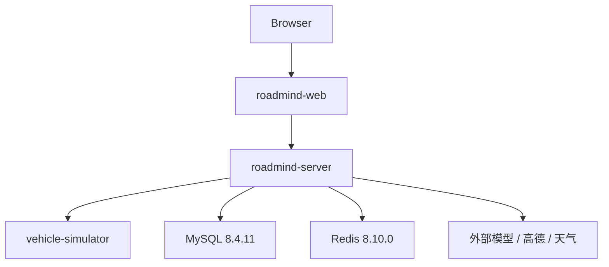

# RoadMind Agent 架构设计

> 文档状态：阶段 0 审查通过（开发基线）
> 更新日期：2026-08-03
> 架构原则：模块化单体为主，仅把车辆数字孪生作为独立进程

## 1. 架构结论

首版采用“单仓库 + 模块化单体 + 独立车辆模拟器”的混合结构：

- `roadmind-server`：唯一业务后端，承载会话、Agent 编排、工具运行时、策略、定时任务、行程协调、审计和统一 API。
- `vehicle-simulator`：独立 Spring Boot 进程，仅负责车辆数字孪生状态与指令模拟。
- `roadmind-web`：Vue 3 单页应用，负责智能座舱界面、地图渲染、确认交互和 SSE 消费。
- MySQL：最终事实、业务状态、路线计划、模拟家居状态和审计持久化。
- Redis：短期会话工作集、确认 TTL、幂等、限流、分布式租约和近期事件流。
- 外部适配器：模型、天气、高德路线/地图和家庭设备模拟。

不把 Planner、Policy Gate、Executor、Verifier 拆成网络服务。它们属于同一条强一致业务工作流，拆分只会增加序列化、分布式追踪和故障处理成本。

## 2. 模块化单体与多服务取舍

| 方案 | 优点 | 代价 | 本项目判断 |
| --- | --- | --- | --- |
| 单个 Spring Boot 应用 | 最快、事务简单、调试方便 | 数字孪生边界不明显，无法展示外部系统故障 | 不足以完成模拟器独立验收 |
| 全量微服务 | 边界清晰，可独立扩缩 | 本地运行复杂，网络故障面大，10～14 天不可控 | 拒绝 |
| 模块化单体 + 独立模拟器 | 业务编排保持简单，同时真实展示外部工具调用、超时和验证 | 需要维护两个 Java 进程 | 推荐 |

`roadmind-mcp-server` 在阶段 6 再创建，并复用现有工具注册元数据或调用 `roadmind-server` 的受控 API；不得复制一套业务规则。

## 3. 系统上下文



### 3.1 信任边界

- 用户输入、模型输出和外部工具结果均为不可信数据。
- `roadmind-server` 是授权、风险判断、参数校验和状态推进的唯一决策边界。
- `vehicle-simulator` 是外部系统模拟，不可绕过 `roadmind-server` 直接从前端执行车辆命令。
- 高德 JS Key 会暴露在浏览器端，必须配置安全密钥、域名白名单和独立配额；Web 服务 Key 仅存在服务端。

## 4. 建议仓库结构

阶段 1 再按实际职责创建，不在阶段 0 生成空目录：

```text
roadmind-agent/
├─ roadmind-server/              # 模块化单体，单一可执行应用
│  └─ src/main/java/.../
│     ├─ identity/               # 用户、权限与资源归属
│     ├─ conversation/           # 会话、消息、上下文与记忆
│     ├─ agent/                  # Planner/Policy/Executor/Verifier 编排
│     ├─ tool/                   # 工具契约、注册表、执行运行时
│     ├─ home/                   # 模拟家庭设备状态与 HomeGateway
│     ├─ trip/                   # 路线、能耗、行程与 SSE
│     ├─ scheduling/             # 持久化定时任务与租约
│     ├─ audit/                  # 审计、trace 与查询
│     ├─ adapter/                # 模型、地图、天气、家居、车辆客户端
│     └─ shared/                 # 受控的通用错误、时间、ID、响应契约
├─ vehicle-simulator/            # 独立可执行应用
├─ roadmind-web/                 # Vue 3 + TypeScript
├─ roadmind-mcp-server/          # 阶段 6 才创建
├─ roadmind-evaluation/          # 阶段 8 创建或从测试夹具演进
├─ docker/                       # 需要自定义镜像时再创建
├─ docs/
├─ docker-compose.yml            # 阶段 1 创建
└─ README.md                     # 阶段 1 创建
```

### 4.1 依赖规则

1. `shared` 不依赖任何业务模块。
2. 领域模块可依赖自身领域接口，不直接依赖外部 SDK。
3. `agent` 可依赖 `conversation` 与 `tool` 的公开应用接口，不直接访问它们的 Mapper。
4. `trip` 通过 `RouteGateway`、`VehicleGateway`、`EventPublisher` 接口访问外部系统。
5. `home` 保存模拟设备与版本化状态，实现本地 `MockHomeGateway`；不为一个关灯场景额外创建网络服务。
6. `adapter` 实现领域端口；领域代码不反向依赖 `adapter`。
7. Controller 只做认证上下文、请求校验、调用应用服务和响应映射。
8. 模块边界用包可见性和 ArchUnit 测试约束；无需为每个包创建 Maven 模块。

## 5. 模块职责

| 模块 | 核心职责 | 不负责 |
| --- | --- | --- |
| identity | 用户、角色、车辆/家庭资源归属 | Agent 规划 |
| conversation | 会话、消息、槽位、短期上下文、长期偏好 | 工具授权 |
| agent | 工作流状态机、计划版本、步骤调度 | 具体外部 API 细节 |
| tool | 工具契约、注册、参数 Schema、统一执行结果 | 业务会话管理 |
| home | 模拟家庭设备、状态版本和 Verifier 回查 | 真实智能家居账号或厂商接入 |
| trip | 路线归一化、能耗、行程状态、遥测、SSE | 地图 UI 渲染 |
| scheduling | RoadMind 跨域任务、家居动作、提醒、到期领取与租约 | 车辆模拟器内部原生定时命令、模型理解 |
| audit | 审计追加写、trace 查询、脱敏 | 修改业务事实 |
| adapter | 模型、天气、高德、家居、模拟器客户端 | 重新定义领域规则 |
| vehicle-simulator | 模拟车辆状态、指令、行程推进和故障 | 用户权限和高风险确认 |

## 6. Agent 核心工作流



### 6.1 工作流状态

```text
DRAFT
  -> PLANNING
  -> WAITING_INPUT | WAITING_CONFIRMATION | READY
  -> RUNNING
  -> SUCCEEDED | PARTIAL_SUCCESS | FAILED | CANCELLED
```

每次用户修正或重新规划都会产生新的 `planVersion`。旧版本的确认自动失效，避免用户确认 A 计划却执行 B 计划。

### 6.2 Context Manager

上下文由三个层次组成：

1. **结构化槽位**：起点、终点、时间、车辆、附加任务、偏好；是规划的主要输入。
2. **会话摘要**：保留必要对话语义，不把全部历史直接传给模型。
3. **最近消息窗口**：保留少量原文用于处理指代和修正。

槽位记录 `value`、`source`、`confidence`、`updatedAt` 和 `messageId`。用户明确修正优先级最高；新值覆盖当前有效值，旧值仅进入审计历史。

### 6.3 Planner 与后端边界

模型可以：

- 识别目标与实体；
- 选择注册表公开给它的工具名；
- 提议步骤、依赖和参数；
- 请求补充信息。

模型不可以：

- 决定实际风险级别；
- 判断用户是否有权限；
- 伪造确认状态或幂等键；
- 直接执行工具；
- 修改数据库状态机；
- 决定是否跳过 Verifier。

### 6.4 计划校验

计划进入 Policy Gate 前必须通过：

- JSON Schema / Java DTO 校验；
- 工具名存在且当前启用；
- 步骤数、参数长度和总计划大小限制；
- DAG 无环、依赖存在、步骤 ID 唯一；
- 参数 Schema、枚举、范围、时间和资源 ID 校验；
- 服务端重新绑定用户可访问的车辆和家庭设备；
- 风险级别用工具注册表覆盖，忽略模型输出。

非法结构允许一次受约束修复；仍失败则进入 `PLAN_INVALID`，不得猜测执行。

## 7. 工具注册与执行流程

### 7.1 核心接口

```java
public interface RoadMindTool<I, O> {
    ToolDescriptor descriptor();
    Class<I> inputType();
    ToolExecutionResult<O> execute(I input, ToolExecutionContext context);
}
```

```java
public record ToolDescriptor(
    String name,
    String version,
    ToolRiskLevel riskLevel,
    Duration timeout,
    RetryPolicy retryPolicy,
    boolean idempotent,
    String inputSchemaResource
) {}
```

```java
public record ToolExecutionResult<T>(
    boolean success,
    String toolName,
    String executionId,
    T result,
    String errorCode,
    String errorMessage,
    boolean retryable,
    Instant startedAt,
    Instant finishedAt,
    String traceId
) {}
```

实际代码在阶段 2 创建，此处仅定义边界。

### 7.2 执行序列



### 7.3 执行策略

- 首版按 DAG 拓扑顺序执行，优先保证可解释和可测试。
- 相互独立的只读步骤可在后续优化为有限并行；写步骤保持串行。
- 只读工具可在超时或明确瞬时错误时重试一次。
- 幂等写工具只能使用同一个 `idempotencyKey` 重试一次。
- 高风险写操作失败时停止所有依赖步骤。
- Verifier 不调用原写工具重试，而是调用只读查询或读取本地事实。

## 8. 车辆数字孪生架构



### 8.1 边界接口

`VehicleGateway` 位于 `roadmind-server` 领域端口中；模拟器客户端位于适配器层。未来真实适配器只能作为同一端口的新实现，不能改变 Agent、Policy 或 Trip 领域。

### 8.2 模拟器内部组件

- `VehicleStateRepository`：管理当前车辆快照和版本号。
- `VehicleCommandService`：校验并接受模拟命令，执行状态机。
- `ScheduledCommandEngine`：到期执行预热、锁车等模拟任务。
- `TripSimulationEngine`：沿路线点推进模拟时间、位置、电量和速度。
- `FaultScenarioController`：在显式演示模式下注入低电量、超时或状态不一致。
- `SimulatorEventPublisher`：发布状态变化供 `roadmind-server` 消费或轮询。

阶段 1 可先使用内存状态并提供重置端点；阶段 4 再补齐行程引擎。模拟器不是授权边界，所有用户相关授权仍在 `roadmind-server`。

定时职责不可重叠：`vehicle.schedule_climate` 立即向模拟器创建“车辆原生定时命令”，由模拟器的 `ScheduledCommandEngine` 到点执行并由 `vehicle.get_scheduled_tasks` 验证；`roadmind-server.scheduling` 只负责跨域编排、出门后关灯、启动模拟行程和普通提醒。`schedule.create_task` 首版只允许提醒类白名单 payload，不能把任意工具名/参数塞入低风险任务来绕过底层工具的风险级别。需要延后执行高风险工具时，数据库保存的是已经通过 Policy Gate 的原始高风险步骤和确认 item，而不是一个被降级为 LOW_RISK 的包装调用。

### 8.3 并发与状态一致性

- 车辆状态包含单调递增 `version`。
- 写命令携带可选 `expectedVersion` 和强制的 `idempotencyKey`。
- 模拟器保存最近幂等结果；相同键和相同参数返回原结果，相同键不同参数返回冲突。
- 行程引擎是单车单写者；外部修改通过命令队列串行化。

## 9. 实时地图与行程架构

### 9.1 路线产生与渲染分工

- `roadmind-server` 的 `RouteGateway` 调用高德 Web 服务或可替换实现，得到真实道路路线。
- 服务端把提供商数据转换为内部 `RoutePlan`，统一使用 GCJ-02 坐标并记录 `provider`、`providerRouteId`、`fetchedAt`。
- `vehicle-simulator` 只接收归一化坐标和路段数据，不持有地图 Key。
- `roadmind-web` 通过 `MapProvider` 与 `RouteRenderer` 把内部数据渲染到高德 JS API 2.0。

### 9.2 事件数据流



### 9.3 SSE 策略

- 每个行程使用单调 `sequence`，`eventId` 推荐为 `{tripId}:{sequence}`。
- Redis Stream 保留近期事件，用于短时断线续传。
- 客户端发送 `Last-Event-ID`；服务端从下一序号重放。
- 若请求的事件已超出 Redis 保留窗口，服务端发送 `trip.snapshot`，客户端清空局部状态后继续。
- 浏览器按 `eventId` 去重，只有 `sequence > lastAppliedSequence` 才推进状态。
- 每 15 秒发送心跳；心跳不改变业务序号。
- MySQL 记录状态变化、异常和降采样遥测，不每秒永久保存全部点。

## 10. 数据与事务边界

### 10.1 MySQL

保存用户、偏好、会话、消息、Agent 任务、计划步骤、工具调用、确认组与确认项、模拟家庭设备、车辆元数据、车辆快照、路线计划、行程、降采样遥测、定时任务和审计日志。

### 10.2 Redis

保存：

- 活跃会话上下文和槽位快照；
- 短期待确认数据及 TTL；
- 幂等键与执行结果摘要；
- 限流计数；
- 定时任务 Worker 租约；
- 行程近期 SSE 事件流；
- 可丢失的短期缓存。

Redis 不是任务、确认或审计的唯一事实来源。MySQL 保存确认事实和业务最终状态，Redis 负责低延迟和过期控制。

### 10.3 事务与事件

首版不引入消息队列，也不预建空的 `domain_event` 表。一次本地事务更新任务/步骤状态并写追加审计；事务提交后由应用内发布器把事件写入 Redis Stream，再推送 SSE。若进程在数据库提交后、事件写入前崩溃，客户端通过 MySQL 最新状态快照恢复，可能看不到中间态，但不会把未执行动作伪报为成功。阶段 7 若验收要求“中间事件也不可丢”，再创建 `domain_event_outbox`，由 Outbox Worker 可靠投递；不为此提前引入 Kafka。

## 11. 部署结构

本地演示使用 Docker Compose，但阶段 0 不创建配置：



开发模式可让 Java 和 Vue 在 Windows 主机运行，仅 MySQL、Redis 进入 Docker。完整演示模式再把 Web、Server 和 Simulator 容器化。

阶段 1 默认端口（均允许通过环境变量覆盖）：

| 组件 | 主机端口 | 说明 |
| --- | --- | --- |
| `roadmind-web` 开发服务器 | 5173 | 通过 Vite Proxy 访问 `/api` |
| `roadmind-server` | 8080 | 唯一浏览器业务 API |
| `vehicle-simulator` | 8081 | 仅 Server 调用 |
| MySQL 容器 | 3307 → 3306 | 避免占用常见本机 3306 |
| Redis 容器 | 6380 → 6379 | 避免占用常见本机 6379 |

Compose 使用固定项目名 `roadmind-agent`，容器间按服务名访问；应用配置不得写死主机绝对路径。

## 12. 依赖版本基线

版本核对日期为 2026-08-03。首版选择成熟兼容线，不盲目采用最新主版本。

### 12.1 后端

| 组件 | 建议版本 | 兼容说明 |
| --- | --- | --- |
| Java | 21 LTS | 项目目标版本；Spring Boot 3.5 支持 Java 17～25 |
| Maven | 3.9.16 | 官方当前稳定版；使用 Maven Wrapper 固定 |
| Spring Boot | 3.5.16 | 成熟 3.x 线，降低 Boot 4/Jackson 3 迁移成本 |
| Spring AI BOM | 1.1.8 | 官方支持 Spring Boot 3.4.x/3.5.x |
| MyBatis-Plus | 3.5.17 | 阶段 0 锁定稳定版；使用 Boot 3 starter |
| Flyway | Spring Boot 3.5.16 BOM 管理 | 使用 `flyway-core` + `flyway-mysql`；禁止依赖运行时自动建表 |
| Resilience4j | 2.4.0 | 支持 Spring Boot 3/4，JDK 17 基线，Java 21 可用 |
| Testcontainers BOM | 2.0.5 | 官方 Java 文档当前版本 |
| JUnit Jupiter | Spring Boot BOM 管理 | 不手工覆盖，避免与 Surefire/Platform 不一致 |
| MySQL | 8.4.11 | 8.4 LTS 维护线，固定镜像版本 |
| Redis | 8.10.0 | 固定官方镜像版本，不使用 `8` 或 `latest` 标签 |

Spring AI 1.1.8 的发布基线升级到 Spring Boot 3.5.15；项目使用同一维护线的 Boot 3.5.16。阶段 1 必须实际解析依赖树并运行启动/结构化输出/MCP 相关冒烟测试，验证通过前不把“同维护线”写成已经完成的兼容性结论。

### 12.2 前端

| 组件 | 建议版本 | 兼容说明 |
| --- | --- | --- |
| Node.js | 24.19.0 LTS | 2026-08-03 的 v24 最新 LTS；Vite 8 的 Node 要求已满足 |
| npm | 11.19.0 | 与阶段 1 lockfile 一并固定 `packageManager` 字段 |
| Vue | 3.5.40 | 与 Pinia 4、Vue Router 5 对齐 |
| Vue Router | 5.2.0 | 要求 Vue 3.5.34+、Vite 7.3+/8、Pinia 3/4 |
| Pinia | 4.0.2 | 要求 Vue 3.5.11+、TypeScript 5.6+ |
| Vite | 8.2.0 | Node 24 满足引擎要求 |
| `@vitejs/plugin-vue` | 6.0.8 | 官方 peer range 包含 Vite 8 和 Vue 3 |
| TypeScript | 5.9.3 | 满足 Pinia 要求；有意不采用刚发布的 7.x 主版本，降低脚手架兼容风险 |
| Axios | 1.19.0 | HTTP 客户端；SSE 仍使用原生 `EventSource` |
| Vitest | 4.1.10 | 前端单元测试 |
| `@vue/test-utils` | 2.4.11 | Vue 3 组件测试 |

最终在阶段 1 创建工程时再次执行官方兼容检查，并通过锁文件固定完整依赖树。

## 13. 配置管理

- Spring 使用 `application.yml` 保存无密配置，环境变量覆盖敏感项。
- 建议配置组：`MODEL_*`、`AMAP_WEB_SERVICE_KEY`、`VEHICLE_SIMULATOR_BASE_URL`、`MYSQL_*`、`REDIS_*`、`SECURITY_*`。
- 前端仅使用 `VITE_AMAP_JS_KEY`、`VITE_AMAP_SECURITY_JS_CODE` 等浏览器必需配置；所有 `VITE_` 值都视为公开。
- 提供 `local`、`demo`、`test` Profile；生产 Profile 不进入首版范围。
- `.env.example` 只包含名称和安全示例，不放真实值。
- 日志输出配置来源名称，不输出配置值。
- 数据库结构只通过 Flyway 版本化迁移变更；`ddl-auto` 类自动建表能力关闭，迁移在 MySQL Testcontainers 中验证。
- 浏览器首版采用同源/显式源白名单的服务端会话 Cookie。会话 Cookie 为 HttpOnly；所有修改请求同时校验 CSRF Token。开发时 Vue 通过 Vite Proxy 或精确 CORS 配置访问后端，不使用 `*` 与凭据组合。

## 14. 错误、日志与审计

### 14.1 错误分类

```text
VALIDATION_ERROR
MISSING_CONTEXT
POLICY_DENIED
CONFIRMATION_REQUIRED
CONFIRMATION_EXPIRED
IDEMPOTENCY_CONFLICT
EXTERNAL_TIMEOUT
EXTERNAL_UNAVAILABLE
TOOL_EXECUTION_FAILED
VERIFICATION_MISMATCH
STATE_CONFLICT
INTERNAL_ERROR
```

错误响应包含稳定业务码、用户可理解消息、`traceId` 和可选恢复建议；不向前端暴露堆栈或供应商密钥。

### 14.2 日志层次

- 应用日志：启动、请求、状态变化和异常；结构化 JSON。
- 工具调用日志：工具、版本、耗时、尝试次数、脱敏参数摘要和结果摘要。
- 审计日志：用户、动作、资源、决策、前后状态摘要、trace、时间，不可被普通业务更新覆盖。
- 模型日志：模型名、请求 ID、Token 用量、延迟、结构校验结果；默认不保存完整 Prompt。

## 15. 测试架构

- **单元测试**：槽位覆盖、DAG 校验、策略矩阵、幂等、能耗、heading、状态机。
- **模块集成测试**：Planner Stub → Policy → Executor → Verifier 完整闭环。
- **数据库集成测试**：MySQL/Redis Testcontainers，验证索引、事务、租约和 TTL。
- **适配器契约测试**：车辆、地图、天气和模型 Stub/WireMock 契约。
- **SSE 测试**：事件顺序、重放、快照恢复、心跳、去重和完成关闭。
- **前端测试**：Store、状态映射、确认弹窗、错误/断线状态和遥测插值。
- **端到端测试**：核心演示流程、未确认拦截、低电量重规划和地图降级。
- **Agent 评测**：固定用例、固定模型参数、保存原始运行元数据，不预设通过率。

## 16. 主要项目风险

| 风险 | 影响 | 早期信号 | 控制与减法 |
| --- | --- | --- | --- |
| 10～14 天范围过大 | 核心闭环未完成却有大量空模块 | 阶段 2 前已创建 MCP/评测空工程 | 严格按阶段创建；优先 0～4、关键安全和基础评测 |
| 模型兼容差异 | Tool Calling/结构化输出不稳定 | 同一 Prompt 在兼容端点返回不同字段 | 封装 ModelGateway、Schema 校验、一次修复、固定测试 Stub |
| 高德 Key/配额/域名问题 | 真实路线或地图无法演示 | 本地能用、部署域名失败或频繁限流 | 前后端 Key 分离、白名单、缓存、地图降级、提前真机验收 |
| Windows + Docker 差异 | README 无法复现 | 卷权限、端口、换行或 PowerShell 命令失败 | 所有命令在 Windows 实跑；Wrapper、健康检查、无绝对路径 |
| 状态机/并发复杂 | 重复执行、确认错绑、行程状态乱 | 并发确认或 pause/cancel 出现双成功 | 聚合服务、乐观锁、唯一索引、幂等和并发集成测试 |
| SSE 重连不完整 | 页面重复、丢事件或车辆跳跃 | 刷新后时间线与后端状态不一致 | 单调序号、Redis Stream、客户端去重、超窗快照 |
| Verifier 语义模糊 | 调用成功被误报成任务成功 | 下游 200 但查询不到目标状态 | 每个写工具定义专用回查和 UNKNOWN/VERIFICATION_FAILED |
| 安全层被框架自动调用绕过 | 未确认写操作直接执行 | Planner/ChatClient 直接绑定写函数 | 模型仅提议；所有调用转为 AuthorizedToolCall 后再执行 |
| 模拟被误解为真实车接入 | 求职可信度受损 | UI/README 只写“车辆控制”无模拟标识 | 全链路 `SIMULATION` 标识和固定免责声明 |
| 公开指标不可复现 | README/简历可信度受损 | 手填百分比、缺模型与运行日期 | 只从保存的评测 run 生成，公开失败明细和运行方法 |

## 17. Architecture Decisions

### ADR-001：采用模块化单体而非全量微服务

- **状态**：已接受
- **原因**：核心 Agent 工作流需要强一致状态推进，个人项目周期短。
- **结果**：只有车辆模拟器独立；其余业务先在 `roadmind-server` 内按包边界隔离。

### ADR-002：车辆模拟器独立进程

- **状态**：已接受
- **原因**：真实展示外部系统的超时、重试、熔断、幂等和 Verifier，同时明确不接真实车辆。
- **结果**：`VehicleGateway` 隔离实现，未来适配器不会进入首版。

### ADR-003：Spring Boot 3.5.16 + Spring AI 1.1.8

- **状态**：已接受
- **原因**：Spring AI 1.1.8 官方支持 Boot 3.4/3.5；Boot 3.5 生态成熟。Spring AI 2.0 需要 Boot 4.0/4.1，会同时引入更大的框架迁移面。
- **结果**：首版不使用 Spring AI 2.0 独占能力，后续独立评估升级。

### ADR-004：服务端拥有风险与授权真相

- **状态**：已接受
- **原因**：模型输出不可作为安全决策。
- **结果**：风险、权限、白名单、确认、幂等均来自服务端配置和数据库。

### ADR-005：Redis Stream 承载短期 SSE 重放

- **状态**：已接受
- **原因**：支持 `Last-Event-ID` 和近期事件恢复，避免把每秒遥测全部永久写入 MySQL。
- **结果**：超出保留窗口时发送最新快照，MySQL保存降采样和关键状态。

### ADR-006：高德路线与地图渲染分离

- **状态**：已接受
- **原因**：前端 SDK 适合渲染，服务端 Web API 适合业务规划、审计和模拟器使用。
- **结果**：内部 `RoutePlan` 隔离供应商格式，统一 GCJ-02。

### ADR-007：首版使用持久化轮询调度，不引入 Quartz/Kafka

- **状态**：已接受
- **原因**：任务量小，但需要服务重启恢复和避免重复执行。
- **结果**：MySQL 定时任务表 + Worker 租约；阶段 7 再评估 Outbox。

### ADR-008：不接入真实车辆 API

- **状态**：已接受且不可在首版变更
- **原因**：缺少合法厂商开放接口、认证授权和真实车辆安全条件；伪造接入会误导用户与面试官。
- **结果**：所有车辆数据和控制明确标注模拟，README 保留免责声明。

### ADR-009：浏览器使用会话 Cookie + CSRF

- **状态**：已接受
- **原因**：原生 `EventSource` 对自定义 Authorization Header 支持差，同源 Cookie 能让普通 API 与 SSE 复用身份。
- **结果**：会话 Cookie 使用 HttpOnly、SameSite；写请求要求 CSRF Token。Bearer 仅保留给未来非浏览器客户端，长期 Token 不进入 URL。

### ADR-010：数据库迁移统一使用 Flyway

- **状态**：已接受
- **原因**：MyBatis-Plus 不负责可靠的版本化建表，公开仓库需要可复现的数据库演进。
- **结果**：迁移脚本随阶段逐步增加并由 Testcontainers 验证；不一次性创建尚未实现的空表。

### ADR-011：开源许可证采用 MIT

- **状态**：已接受
- **原因**：个人求职展示项目需要简洁、宽松且易理解的复用条款。
- **结果**：阶段 1 创建标准 MIT `LICENSE`；第三方 SDK、地图数据和素材仍分别遵守其自身条款，MIT 不授予车辆厂商或地图数据权利。

## 18. 官方版本依据

- Spring Boot 3.5.16 系统要求：<https://docs.spring.io/spring-boot/3.5/system-requirements.html>
- Spring AI 1.1.8 与 Boot 3.4/3.5 兼容：<https://docs.spring.io/spring-ai/reference/1.1/getting-started.html>
- Spring AI 1.1.8 发布记录：<https://github.com/spring-projects/spring-ai/releases/tag/v1.1.8>
- MyBatis-Plus 3.5.17：<https://github.com/baomidou/mybatis-plus/releases>
- Resilience4j 2.4.0：<https://github.com/resilience4j/resilience4j/releases/tag/v2.4.0>
- Testcontainers for Java 2.0.5：<https://java.testcontainers.org/>
- Maven 3.9.16：<https://maven.apache.org/download.cgi>
- Node.js 发布状态：<https://nodejs.org/en/about/previous-releases>
- Node.js v24 最新发布：<https://nodejs.org/download/release/latest-v24.x/>
- Vite 8：<https://vite.dev/blog/announcing-vite8>
- 高德地图 JS API 2.0：<https://lbs.amap.com/api/javascript-api-v2/summary>
- MySQL 8.4 发布记录：<https://dev.mysql.com/doc/relnotes/mysql/8.4/en/>
- Redis 官方镜像标签：<https://hub.docker.com/_/redis>
