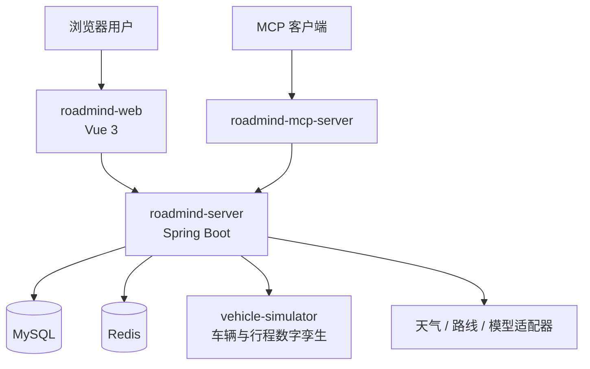
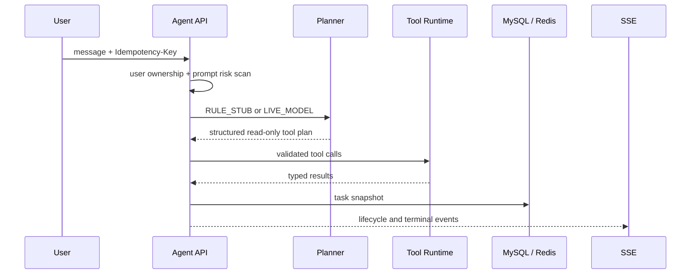

# RoadMind Agent 当前架构

本文描述仓库当前代码的运行结构和信任边界，不是开发路线图。数据库结构以 `roadmind-server/src/main/resources/db/migration/` 中的 Flyway 迁移为准，HTTP 行为以 Controller、测试和实际运行结果为准。

## 1. 系统目标

RoadMind 演示一个受控的任务型 Agent：用户可以用自然语言描述出行目标，但模型没有系统权限。所有工具调用、资源归属、风险判断、确认、执行和结果验证都由 Java 后端完成。

项目只连接车辆与家居数字孪生，不连接真实厂商账号或真实车辆。

## 2. 运行组件



### `roadmind-web`

- 提供 `/agent`、`/plan`、`/trip`、`/vehicle` 和 `/automation` 页面；
- 通过 Cookie 会话和 CSRF 与主服务通信；
- 消费 Agent 与 Trip SSE；
- 地图 Key 缺失时显示明确的降级视图，不把固定路线伪装成实时地图。

### `roadmind-server`

唯一业务后端，包含：

- 会话与用户隔离上下文；
- 异步只读 Agent；
- 可确认 Core Workflow；
- Tool Runtime；
- Trip 编排与事件流；
- 偏好、定时任务、审计、限流和恢复逻辑；
- MySQL、Redis、车辆模拟器、高德和模型适配器。

### `vehicle-simulator`

独立 Spring Boot 进程，负责：

- 固定演示车辆状态；
- 乐观版本和幂等状态更新；
- 车辆原生定时预热；
- Trip 状态机、位置、电量、速度和遥测推进；
- 家居与车辆能力的数字孪生边界。

模拟器不做用户授权，也不接受浏览器直接调用。所有权限与高风险确认都在主服务完成。

### `roadmind-mcp-server`

无状态 MCP 协议适配层：

- 使用独立 Token 保护入口；
- 只暴露 `vehicle.get_status`、`weather.get_forecast`、`route.plan`；
- 调用最终仍回到主服务的 Tool Runtime；
- 不暴露车辆、家居或调度写操作。

### `roadmind-evaluation`

保存确定性离线 fixture 和评测运行器。评测验证规则规划、安全拦截和输出契约，不代表任意真实模型的通用质量。

## 3. 两条 Agent 链路

### 3.1 异步只读 Agent

对应 `/agent` 页面和 `AgentWorkflowService`。



关键限制：

- Live Model 只能选择已注册的只读工具；
- 模型输出必须通过严格 JSON 解析、工具存在性和调用数量校验；
- Tool Runtime 再执行 DTO 转换、Bean Validation、16 KiB 参数上限、超时和有限重试；
- Agent 与 Tool Runtime 使用有界线程池，队列满时返回 `AGENT_BUSY` 或 `TOOL_BUSY`；
- Agent 任务、幂等记录和 Redis 快照都绑定当前用户名。

### 3.2 可确认 Core Workflow

对应 `/plan` 页面和 `CoreWorkflowService`。

该链路使用服务端确定性 DAG 演示高风险工作流：

1. 多轮消息补齐出发地、目的地和时间；
2. 生成版本化步骤；
3. 服务端为车辆预热与家居控制标记高风险；
4. 确认绑定 `workflowId`、用户、计划版本、确认 ID 和 payload hash；
5. 执行后通过数字孪生状态回查；
6. 延后家居动作在真正产生副作用前重新读取并验证原始授权。

模型不能创建或批准这条链路中的高风险授权。

## 4. 数据职责

### MySQL：事实源

Flyway V1–V10 管理当前结构，覆盖：

- 用户、会话和消息；
- Agent 任务；
- Workflow 快照与用户归属；
- 路线、Trip、遥测快照与 Outbox；
- 偏好、定时任务与延后动作授权；
- 审计事件。

不维护另一份手写表结构清单，避免文档和迁移漂移。

### Redis：缓存与协调

Redis 用于：

- 用户作用域的会话上下文与 Agent 任务投影；
- Workflow 状态、槽位、待确认摘要和会话索引；
- 幂等重放辅助；
- 原子固定窗口限流；
- 短期恢复和协调。

Redis 不是持久业务事实的唯一来源。缓存 JSON 同时保存 owner 信息，避免只改 key 就伪造其他用户的数据。

### 进程内状态

进程内结构用于正在执行的任务、SSE 通道和快速索引。它们具有容量或保留时间限制：

- 已完成 Agent SSE 通道只保留短期重放窗口；
- Agent 和工具执行队列有硬上限；
- 本地限流降级表有最大容量并在达到容量时 fail closed。

## 5. 安全边界

### 身份与资源归属

- `demo` Profile 只允许回环地址自动登录；
- 非 demo Profile 不提供自动身份；
- 会话、Agent 任务、Workflow、Trip、偏好与定时任务都在服务层验证所属用户；
- 无权访问与资源不存在统一表现为不可见，减少资源枚举。

### 浏览器请求

- Cookie 会话使用 HttpOnly 与 SameSite；
- 修改请求需要 CSRF；
- CORS 只允许配置中的精确来源并允许凭据，不使用通配来源。

### 工具执行

- 工具由服务端注册，模型和客户端不能降低风险级别；
- 未知字段和未知工具被拒绝；
- 高风险写操作不能通过 MCP 暴露；
- 写操作使用幂等键，并在必要时回查目标状态；
- 内部 MCP Token 使用常量时间比较。

### 提示注入

提示注入扫描只是一层早期信号。真正的安全保证来自：

- 最小工具集合；
- 服务端 Schema 与风险注册；
- 用户与资源归属校验；
- 高风险确认；
- 有界执行与审计。

## 6. 可靠性与恢复

- MySQL 可用时写入任务和 Workflow 事实；
- Redis 提供用户隔离的短期投影；
- MySQL 暂时不可用时，已有会话和任务可以从 Redis 恢复；
- 服务重启后，终态 Agent 任务可重建 SSE 终态事件；
- 重启前仍处于执行中的任务会转为 `AGENT_RESTARTED`，不会永久停留在运行中；
- Trip 使用事务 Outbox 与租约处理事件投递；
- 外部路线、天气和模拟器调用使用超时、Retry、Circuit Breaker 或 Bulkhead，具体策略按调用副作用区分。

## 7. 主要代码边界

```text
roadmind-server/src/main/java/com/roadmind/server/
├─ agent/          # 异步只读 Agent、快照、恢复与 SSE
├─ workflow/       # 可确认 DAG、高风险授权和结果回查
├─ tool/           # 工具描述、输入校验、超时与执行边界
├─ trip/           # 路线、Trip 状态、事件和 Outbox
├─ conversation/   # 会话事实与 Redis 上下文投影
├─ scheduling/     # 提醒、延后动作和任务租约
├─ preference/     # 用户偏好与地点别名
├─ security/       # 认证、CSRF、CORS、限流和资源保护
├─ audit/          # 脱敏审计
└─ adapter/        # 高德与车辆模拟器适配器
```

Controller 只负责认证上下文、请求校验、调用应用服务和映射响应。业务授权与资源归属不依赖 Controller 中的路径参数判断。

## 8. 明确不做的事情

- 不连接真实车辆或真实厂商账号；
- 不把 demo 自动登录当成生产认证；
- 不让模型直接执行写工具或自我授权；
- 不把 Stub 数据标记成 Live；
- 不提供公网 MCP、多租户 SaaS、生产密钥托管或真实导航服务；
- 不把离线规则 fixture 的结果宣传成真实模型能力。

## 9. 相关文档

- [项目启动与能力概览](../README.md)
- [MCP 集成说明](mcp-integration.md)
- [离线评测说明](../roadmind-evaluation/README.md)
- [安全问题报告策略](../SECURITY.md)
