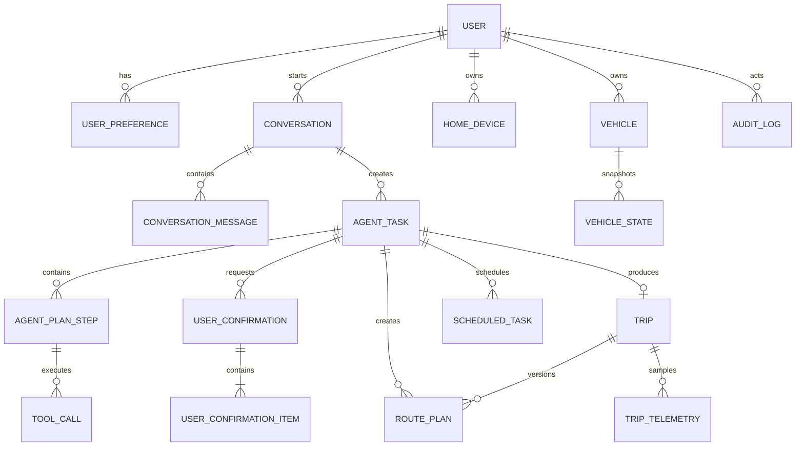

# RoadMind Agent 数据库设计

> 文档状态：阶段 0 审查通过（实现前草案）
> 数据库：MySQL 8.4.11
> 缓存与短期状态：Redis 8.10.0

## 1. 设计原则

1. MySQL 保存业务最终事实；Redis 不作为任务、确认和审计的唯一来源。
2. 首版使用逻辑清晰的关系模型，不为遥测引入时序数据库。
3. 所有业务表统一使用 `BIGINT UNSIGNED` 主键，阶段 1 使用 MyBatis-Plus `ASSIGN_ID` 生成。
4. 时间统一存 UTC 的 `DATETIME(3)`，API 使用 ISO 8601；用户时区另存 IANA Zone ID，如 `Asia/Shanghai`。
5. 状态字段使用可读 `VARCHAR`，避免 MySQL `ENUM` 阻碍演进；Java 端使用枚举并加数据库约束或应用校验。
6. JSON 只保存可演进快照或供应商原始摘要，不用 JSON 代替高频查询字段。
7. 所有写入表包含 `created_at`、`updated_at`；需要并发保护的聚合根包含 `version`。
8. 软删除只用于用户可恢复资源；审计、调用和消息记录不做普通业务删除。
9. 结构变更统一通过 Flyway 迁移；关闭自动建表。每个阶段只创建实际使用的表，并在 MySQL Testcontainers 空库与升级路径中验证。

## 2. 命名与公共字段

| 项目 | 约定 |
| --- | --- |
| 表名 | 小写蛇形，单数语义，如 `agent_task` |
| 主键 | `id BIGINT UNSIGNED` |
| 外键字段 | `{entity}_id` |
| 时间 | `DATETIME(3)`，UTC |
| 布尔值 | `TINYINT(1)` |
| 乐观锁 | `version INT UNSIGNED` |
| Trace | `trace_id VARCHAR(64)` |
| 幂等键 | `idempotency_key VARCHAR(128)` |
| 内容摘要 | SHA-256 十六进制 `CHAR(64)` |

首版可以由应用维护引用完整性，测试库建议创建关键外键。若因批量清理或演示重置不使用物理外键，必须保留索引和集成测试，不能依赖“约定正确”。

## 3. 实体关系概览



## 4. 核心表设计

### 4.1 `user`

用途：演示用户与安全主体。

| 字段 | 类型 | 约束/说明 |
| --- | --- | --- |
| id | BIGINT UNSIGNED | PK |
| username | VARCHAR(64) | 唯一；不区分大小写策略需固定 |
| display_name | VARCHAR(80) | 展示名 |
| password_hash | VARCHAR(255) | 可空；阶段 1 可用固定 demo 身份，正式登录时必填 |
| role | VARCHAR(32) | `USER` / `ADMIN` |
| timezone | VARCHAR(64) | 默认 `Asia/Shanghai` |
| status | VARCHAR(24) | `ACTIVE` / `DISABLED` |
| created_at | DATETIME(3) | 非空 |
| updated_at | DATETIME(3) | 非空 |
| version | INT UNSIGNED | 乐观锁 |

索引：`uk_user_username(username)`。

敏感字段：`password_hash`，永不进入日志、模型上下文或 API 响应。

### 4.2 `user_preference`

用途：分类保存长期偏好和常用地点。

| 字段 | 类型 | 说明 |
| --- | --- | --- |
| id | BIGINT UNSIGNED | PK |
| user_id | BIGINT UNSIGNED | 用户 |
| category | VARCHAR(32) | `LOCATION` / `CLIMATE` / `CHARGING` / `REMINDER` / `VEHICLE` / `HOME_DEVICE` |
| preference_key | VARCHAR(80) | 如 `school`、`default_temperature` |
| value_json | JSON | 结构化值 |
| sensitivity | VARCHAR(24) | `NORMAL` / `SENSITIVE` |
| expires_at | DATETIME(3) | 可空 |
| deleted_at | DATETIME(3) | 可空，用户删除 |
| created_at / updated_at | DATETIME(3) | 时间 |
| version | INT UNSIGNED | 乐观锁 |

索引：

- 唯一 `uk_preference_user_key(user_id, category, preference_key)`；
- `idx_preference_expiry(expires_at)`；
- `idx_preference_user_active(user_id, deleted_at)`。

敏感字段：地点和家庭设备映射属于敏感偏好，进入 Prompt 前按任务最小化提取。

### 4.3 `conversation`

用途：会话聚合根。

| 字段 | 类型 | 说明 |
| --- | --- | --- |
| id | BIGINT UNSIGNED | PK |
| user_id | BIGINT UNSIGNED | 用户 |
| title | VARCHAR(160) | 可自动生成 |
| status | VARCHAR(24) | `ACTIVE` / `CLOSED` / `EXPIRED` |
| context_summary | TEXT | 脱敏摘要，可空 |
| context_version | INT UNSIGNED | 上下文修正版本 |
| last_message_at | DATETIME(3) | 最近消息 |
| expires_at | DATETIME(3) | 短期上下文过期时间 |
| created_at / updated_at | DATETIME(3) | 时间 |
| version | INT UNSIGNED | 乐观锁 |

索引：`idx_conversation_user_time(user_id, last_message_at DESC)`、`idx_conversation_expiry(status, expires_at)`。

活跃槽位工作集在 Redis；MySQL保存摘要和版本，必要时可从消息与任务恢复。

### 4.4 `conversation_message`

用途：用户、Agent 和系统事件消息。

| 字段 | 类型 | 说明 |
| --- | --- | --- |
| id | BIGINT UNSIGNED | PK，同时用于稳定排序 |
| conversation_id | BIGINT UNSIGNED | 会话 |
| role | VARCHAR(24) | `USER` / `ASSISTANT` / `SYSTEM_EVENT` |
| content | MEDIUMTEXT | 消息正文；审计环境下需脱敏策略 |
| content_type | VARCHAR(24) | `TEXT` / `PLAN` / `CONFIRMATION` / `RESULT` |
| token_count | INT UNSIGNED | 可空，实际返回时记录 |
| model_name | VARCHAR(80) | 可空 |
| trace_id | VARCHAR(64) | 链路 |
| created_at | DATETIME(3) | 时间 |

索引：`idx_message_conversation_id(conversation_id, id)`、`idx_message_trace(trace_id)`。

数据保留：默认 90 天；演示重置可显式清理，公开仓库不带真实会话数据。

### 4.5 `agent_task`

用途：一次用户目标的执行聚合根。

| 字段 | 类型 | 说明 |
| --- | --- | --- |
| id | BIGINT UNSIGNED | PK |
| conversation_id | BIGINT UNSIGNED | 所属会话 |
| user_id | BIGINT UNSIGNED | 冗余便于鉴权查询 |
| goal | TEXT | 归一化目标 |
| status | VARCHAR(32) | `DRAFT` 等任务状态 |
| current_plan_version | INT UNSIGNED | 当前有效计划版本 |
| entities_json | JSON | 当前结构化实体快照 |
| failure_code | VARCHAR(64) | 可空 |
| failure_message | VARCHAR(500) | 脱敏错误 |
| trace_id | VARCHAR(64) | 根 trace |
| started_at / finished_at | DATETIME(3) | 可空 |
| created_at / updated_at | DATETIME(3) | 时间 |
| version | INT UNSIGNED | 乐观锁 |

索引：

- `idx_task_conversation_time(conversation_id, created_at DESC)`；
- `idx_task_user_status(user_id, status, updated_at DESC)`；
- `idx_task_trace(trace_id)`。

### 4.6 `agent_plan_step`

用途：版本化计划中的 DAG 步骤。

| 字段 | 类型 | 说明 |
| --- | --- | --- |
| id | BIGINT UNSIGNED | PK |
| task_id | BIGINT UNSIGNED | Agent 任务 |
| plan_version | INT UNSIGNED | 计划版本 |
| step_key | VARCHAR(64) | 如 `step-001` |
| tool_name | VARCHAR(128) | 注册工具名 |
| tool_version | VARCHAR(32) | 执行时注册版本 |
| risk_level | VARCHAR(32) | 服务端覆盖后的风险 |
| input_json | JSON | 校验后的输入；敏感值需最小化 |
| input_hash | CHAR(64) | 参数摘要 |
| depends_on_json | JSON | 步骤 key 数组 |
| status | VARCHAR(32) | `PENDING` / `BLOCKED` / `WAITING_CONFIRMATION` / `READY` / `RUNNING` / `SUCCEEDED` / `FAILED` / `SKIPPED` / `VERIFICATION_FAILED` |
| attempt_count | SMALLINT UNSIGNED | 执行次数 |
| started_at / finished_at | DATETIME(3) | 可空 |
| created_at / updated_at | DATETIME(3) | 时间 |
| version | INT UNSIGNED | 乐观锁 |

索引：

- 唯一 `uk_step_task_version_key(task_id, plan_version, step_key)`；
- `idx_step_task_status(task_id, plan_version, status)`；
- `idx_step_tool(tool_name, created_at)`。

### 4.7 `tool_call`

用途：每一次真实工具调用尝试。

| 字段 | 类型 | 说明 |
| --- | --- | --- |
| id | BIGINT UNSIGNED | PK；可作为 executionId |
| task_id | BIGINT UNSIGNED | 任务 |
| plan_step_id | BIGINT UNSIGNED | 步骤 |
| attempt_no | SMALLINT UNSIGNED | 从 1 开始 |
| tool_name / tool_version | VARCHAR | 工具元数据 |
| idempotency_key | VARCHAR(128) | 写操作必填 |
| request_summary_json | JSON | 脱敏输入摘要 |
| response_summary_json | JSON | 脱敏输出摘要 |
| status | VARCHAR(32) | `STARTED` / `SUCCEEDED` / `FAILED` / `TIMED_OUT` / `REJECTED` |
| error_code | VARCHAR(64) | 可空 |
| retryable | TINYINT(1) | 是否可重试 |
| duration_ms | INT UNSIGNED | 耗时 |
| trace_id | VARCHAR(64) | trace |
| started_at / finished_at | DATETIME(3) | 时间 |
| created_at | DATETIME(3) | 时间 |

索引：

- `idx_tool_call_step(plan_step_id, attempt_no)`；
- `idx_tool_call_trace(trace_id)`；
- `idx_tool_call_name_time(tool_name, created_at DESC)`；
- 对写工具建议唯一 `uk_tool_idempotency(tool_name, idempotency_key)`；只读调用允许 `idempotency_key` 为空。

### 4.8 `user_confirmation`

用途：高风险或需要展示确认的操作授权事实。

| 字段 | 类型 | 说明 |
| --- | --- | --- |
| id | BIGINT UNSIGNED | PK，同时作为对外 confirmationId |
| task_id | BIGINT UNSIGNED | 任务 |
| user_id | BIGINT UNSIGNED | 确认者 |
| plan_version | INT UNSIGNED | 绑定版本 |
| payload_hash | CHAR(64) | 组内项目按稳定顺序组成的规范化摘要 |
| status | VARCHAR(32) | `PENDING` / `PARTIALLY_DECIDED` / `APPROVED` / `REJECTED` / `EXPIRED` |
| reason | VARCHAR(500) | 拒绝或说明，可空 |
| expires_at | DATETIME(3) | 必填 |
| decided_at | DATETIME(3) | 可空 |
| created_at / updated_at | DATETIME(3) | 时间 |
| version | INT UNSIGNED | 并发决策 |

索引：

- `idx_confirmation_task_status(task_id, status)`；
- `idx_confirmation_user_expiry(user_id, status, expires_at)`；
- `idx_confirmation_payload(payload_hash)`。

确认组只负责一次 UI 展示和批量决策边界，逐项授权事实由 `user_confirmation_item` 保存。确认只授权精确的 `planVersion + item(stepId + toolVersion + resourceId + payloadHash)`，任何参数或计划变化都必须重新确认。

### 4.9 `user_confirmation_item`

用途：保存确认组内每个高风险步骤的独立决定与一次性领取状态，支持逐项批准、逐项拒绝和批量提交。

| 字段 | 类型 | 说明 |
| --- | --- | --- |
| id | BIGINT UNSIGNED | PK，对外 confirmationItemId |
| confirmation_id | BIGINT UNSIGNED | 确认组 |
| plan_step_id | BIGINT UNSIGNED | 被授权步骤 |
| tool_name / tool_version | VARCHAR | 确认时的工具版本 |
| resource_type / resource_id | VARCHAR | 目标资源 |
| payload_hash | CHAR(64) | 单项规范化参数摘要 |
| decision_status | VARCHAR(24) | `PENDING` / `APPROVED` / `REJECTED` / `EXPIRED` |
| claim_status | VARCHAR(24) | `NOT_READY` / `READY` / `CLAIMED` / `REVOKED` |
| decided_at / claimed_at | DATETIME(3) | 可空 |
| created_at / updated_at | DATETIME(3) | 时间 |
| version | INT UNSIGNED | 原子决定与领取 |

索引：

- 唯一 `uk_confirmation_item_step(confirmation_id, plan_step_id)`；
- `idx_confirmation_item_decision(confirmation_id, decision_status)`；
- `idx_confirmation_item_claim(claim_status, updated_at)`。

批准事务必须同时把 item 置为 `APPROVED/READY`，并把对应计划步骤从 `WAITING_CONFIRMATION` 置为 `READY`。Executor 领取时在同一事务中把步骤置为 `RUNNING`、item 置为 `CLAIMED`；崩溃恢复仍沿用该步骤的确定性幂等键。

### 4.10 `home_device`

用途：保存模拟家庭设备及其可回查状态，支撑 `home.control_device` 与 Verifier；不创建额外家居微服务。

| 字段 | 类型 | 说明 |
| --- | --- | --- |
| id | BIGINT UNSIGNED | PK |
| user_id | BIGINT UNSIGNED | 归属用户 |
| device_key | VARCHAR(80) | 如 `living-room-light` |
| display_name / room_name | VARCHAR(80) | 安全展示名和房间名 |
| device_type | VARCHAR(32) | 首版 `LIGHT` |
| state_json | JSON | 白名单状态，如 `{"power":"OFF"}` |
| mode | VARCHAR(24) | 固定 `SIMULATION` |
| status | VARCHAR(24) | `ONLINE` / `OFFLINE` / `DISABLED` |
| created_at / updated_at | DATETIME(3) | 时间 |
| version | INT UNSIGNED | 乐观锁与 Verifier 回查版本 |

索引：唯一 `uk_home_device_user_key(user_id, device_key)`、`idx_home_device_user_status(user_id, status)`。

### 4.11 `vehicle`

用途：用户可访问的车辆元数据；首版均为数字孪生。

| 字段 | 类型 | 说明 |
| --- | --- | --- |
| id | BIGINT UNSIGNED | PK |
| user_id | BIGINT UNSIGNED | 归属用户 |
| simulator_vehicle_key | VARCHAR(80) | 如 `demo-vehicle-001` |
| display_name | VARCHAR(80) | 如“RoadMind Demo Car” |
| gateway_type | VARCHAR(24) | 固定 `SIMULATOR` |
| status | VARCHAR(24) | `ACTIVE` / `OFFLINE` / `DISABLED` |
| created_at / updated_at | DATETIME(3) | 时间 |
| version | INT UNSIGNED | 乐观锁 |

索引：唯一 `uk_vehicle_simulator_key(simulator_vehicle_key)`、`idx_vehicle_user(user_id, status)`。

不得出现真实厂商 token、VIN 或认证材料。若未来研究真实适配器，凭据也不能存本表明文。

### 4.12 `vehicle_state`

用途：关键车辆状态快照，不保存每秒位置。

| 字段 | 类型 | 说明 |
| --- | --- | --- |
| id | BIGINT UNSIGNED | PK |
| vehicle_id | BIGINT UNSIGNED | 车辆 |
| simulator_version | BIGINT UNSIGNED | 模拟器状态版本 |
| battery_percent | DECIMAL(5,2) | 0～100 |
| estimated_range_km | DECIMAL(8,2) | 非负 |
| cabin_temperature | DECIMAL(5,2) | 摄氏度 |
| door_locked | TINYINT(1) | 锁状态 |
| charging | TINYINT(1) | 充电状态 |
| longitude / latitude | DECIMAL(10,7) | GCJ-02 |
| tire_pressure_json | JSON | 四轮胎压 |
| snapshot_reason | VARCHAR(32) | `QUERY` / `COMMAND` / `TRIP_EVENT` / `VERIFICATION` |
| observed_at | DATETIME(3) | 模拟器观测时间 |
| created_at | DATETIME(3) | 写入时间 |

索引：唯一 `uk_vehicle_state_version(vehicle_id, simulator_version)`、`idx_vehicle_state_time(vehicle_id, observed_at DESC)`。

保留策略：演示环境 30 天；可按车辆只保留每日/关键快照。

### 4.13 `route_plan`

用途：持久化经校验的路线版本，使 API 中的 `routePlanId`、动态重规划和行程恢复有明确事实来源。

| 字段 | 类型 | 说明 |
| --- | --- | --- |
| id | BIGINT UNSIGNED | PK，对外 routePlanId |
| user_id / task_id | BIGINT UNSIGNED | 归属；task_id 可空用于手工演示 |
| trip_id | BIGINT UNSIGNED | 可空；行程创建或重规划后关联 |
| route_version | INT UNSIGNED | 同一任务/行程内递增 |
| provider | VARCHAR(32) | `AMAP` / `FALLBACK` |
| source_mode | VARCHAR(24) | `LIVE` / `CACHE` / `STUB`，禁止混淆来源 |
| provider_route_id | VARCHAR(128) | 可空，供应商返回值 |
| coordinate_system | VARCHAR(16) | 首版 `GCJ-02` |
| origin_json / destination_json | JSON | 名称与坐标 |
| polyline_json | MEDIUMTEXT 或 JSON | 归一化有序道路坐标 |
| segments_json | MEDIUMTEXT 或 JSON | 路段摘要与索引 |
| distance_meters | INT UNSIGNED | 总距离 |
| duration_seconds | INT UNSIGNED | 规划时长 |
| route_hash | CHAR(64) | 规范化路线摘要 |
| status | VARCHAR(24) | `VALID` / `REPLACED` / `INVALID` |
| fetched_at / expires_at | DATETIME(3) | 来源时间与缓存有效期 |
| created_at | DATETIME(3) | 时间 |

索引：`idx_route_task_version(task_id, route_version)`、`idx_route_trip_version(trip_id, route_version)`、`idx_route_hash(route_hash)`、`idx_route_expiry(status, expires_at)`。

供应商原始响应只保存最小必要摘要；缓存与持久化期限必须遵守提供商条款。`STUB` 路线可用于测试，但 API/UI 必须显示来源，不能标成实时高德结果。

### 4.14 `trip`

用途：行程聚合根。

| 字段 | 类型 | 说明 |
| --- | --- | --- |
| id | BIGINT UNSIGNED | PK |
| task_id | BIGINT UNSIGNED | 来源任务，可空表示手工演示 |
| user_id / vehicle_id | BIGINT UNSIGNED | 归属 |
| current_route_plan_id | BIGINT UNSIGNED | 当前有效路线版本 |
| status | VARCHAR(24) | `PLANNED` / `READY` / `DRIVING` / `PAUSED` / `CHARGING` / `COMPLETED` / `CANCELLED` / `FAILED` |
| origin_json / destination_json | JSON | 名称与坐标 |
| route_provider | VARCHAR(32) | `AMAP` / `FALLBACK` |
| route_hash | CHAR(64) | 路线版本摘要 |
| distance_km | DECIMAL(9,2) | 总距离 |
| planned_duration_seconds | INT UNSIGNED | 预计时长 |
| simulation_speed | SMALLINT UNSIGNED | 1/5/20 |
| current_sequence | BIGINT UNSIGNED | 最新遥测序号 |
| started_at / completed_at | DATETIME(3) | 可空 |
| created_at / updated_at | DATETIME(3) | 时间 |
| version | INT UNSIGNED | 状态机乐观锁 |

索引：`idx_trip_user_time(user_id, created_at DESC)`、`idx_trip_vehicle_status(vehicle_id, status)`、`idx_trip_task(task_id)`。

### 4.15 `trip_telemetry`

用途：降采样遥测和关键事件点。

| 字段 | 类型 | 说明 |
| --- | --- | --- |
| id | BIGINT UNSIGNED | PK |
| trip_id | BIGINT UNSIGNED | 行程 |
| sequence | BIGINT UNSIGNED | 原始序号 |
| event_type | VARCHAR(32) | `SAMPLE` / `STATE_CHANGE` / `LOW_BATTERY` / `ROUTE_CHANGED` |
| longitude / latitude | DECIMAL(10,7) | GCJ-02 |
| speed_kmh | DECIMAL(6,2) | 速度 |
| heading | DECIMAL(6,2) | 0～360 |
| battery_percent | DECIMAL(5,2) | 电量 |
| remaining_range_km | DECIMAL(8,2) | 剩余续航 |
| remaining_distance_km | DECIMAL(9,2) | 剩余距离 |
| estimated_arrival_at | DATETIME(3) | ETA |
| trip_status | VARCHAR(24) | 当时状态 |
| occurred_at | DATETIME(3) | 模拟时间 |
| created_at | DATETIME(3) | 入库时间 |

索引：唯一 `uk_telemetry_trip_sequence(trip_id, sequence)`、`idx_telemetry_trip_time(trip_id, occurred_at)`。

保留策略：每 5～10 秒降采样点保存 30 天；状态变化和异常点保存 180 天。原始 1 Hz 流只在 Redis 短期保留。

### 4.16 `scheduled_task`

用途：持久化未来执行的车辆、家居和提醒任务。

| 字段 | 类型 | 说明 |
| --- | --- | --- |
| id | BIGINT UNSIGNED | PK |
| agent_task_id / plan_step_id | BIGINT UNSIGNED | 来源 |
| confirmation_item_id | BIGINT UNSIGNED | 高风险来源必填；普通提醒可空 |
| user_id | BIGINT UNSIGNED | 归属 |
| task_type | VARCHAR(64) | `REMINDER` / `HOME_CONTROL` / `START_TRIP` 等白名单类型 |
| payload_json | JSON | 已校验参数 |
| payload_hash | CHAR(64) | 参数摘要 |
| idempotency_key | VARCHAR(128) | 唯一 |
| execute_at | DATETIME(3) | UTC |
| timezone | VARCHAR(64) | 原始时区 |
| status | VARCHAR(24) | `PENDING` / `CLAIMED` / `RUNNING` / `SUCCEEDED` / `FAILED` / `CANCELLED` / `EXPIRED` |
| attempt_count | SMALLINT UNSIGNED | 次数 |
| locked_by | VARCHAR(80) | Worker 标识，可空 |
| locked_until | DATETIME(3) | 租约，可空 |
| last_error_code | VARCHAR(64) | 可空 |
| created_at / updated_at | DATETIME(3) | 时间 |
| version | INT UNSIGNED | 并发控制 |

索引：

- 唯一 `uk_scheduled_idempotency(idempotency_key)`；
- `idx_scheduled_due(status, execute_at)`；
- `idx_scheduled_lease(status, locked_until)`；
- `idx_scheduled_user(user_id, created_at DESC)`。

`scheduled_task` 不保存任意 `toolName + args`。普通 `REMINDER` 可由 LOW_RISK 的 `schedule.create_task` 创建；`HOME_CONTROL` 等高风险延后动作必须引用已批准的 `plan_step_id + confirmation_item_id`。车辆预热由模拟器自己的车辆原生定时命令保存，Server 只记录对应 tool call 与审计，不再创建一份重复的 `VEHICLE_CLIMATE` 调度任务。

### 4.17 `audit_log`

用途：追加写的安全与业务审计。

| 字段 | 类型 | 说明 |
| --- | --- | --- |
| id | BIGINT UNSIGNED | PK |
| user_id | BIGINT UNSIGNED | 可空，系统事件为空 |
| action | VARCHAR(80) | 如 `TOOL_POLICY_DENIED` |
| resource_type | VARCHAR(64) | `AGENT_TASK` / `VEHICLE` / `TRIP` 等 |
| resource_id | VARCHAR(80) | 资源 ID |
| decision | VARCHAR(24) | `ALLOW` / `DENY` / `SUCCESS` / `FAILURE` / `INFO` |
| reason_code | VARCHAR(64) | 可空 |
| before_hash / after_hash | CHAR(64) | 可空，状态摘要 |
| detail_json | JSON | 脱敏详情 |
| trace_id | VARCHAR(64) | trace |
| client_ip_hash | CHAR(64) | 可空，不保存明文 IP |
| created_at | DATETIME(3) | 时间，不更新 |

索引：`idx_audit_trace(trace_id)`、`idx_audit_resource(resource_type, resource_id, created_at)`、`idx_audit_user_time(user_id, created_at DESC)`、`idx_audit_action_time(action, created_at DESC)`。

保留策略：演示项目默认 180 天；禁止普通更新和物理覆盖。清理只能由受控维护任务按策略执行并记录清理审计。

## 5. 可选辅助表

以下表只在实际实现需要时创建：

- `model_usage`：每次模型调用的模型名、Token、延迟、结果类型和 trace；若首版字段少，可先合并到工具/审计记录。
- `domain_event_outbox`：阶段 7 若需要可靠地把提交后的事件推入 Redis/SSE，再创建。
- `evaluation_run`、`evaluation_case_result`：阶段 8 评测实现时创建，不能在阶段 1 创建空表。

## 6. MySQL 与 Redis 职责边界

| 数据 | MySQL | Redis | 恢复策略 |
| --- | --- | --- | --- |
| 用户与偏好 | 最终事实 | 热点缓存 | 缓存丢失后回源 |
| 模拟家庭设备 | 最终状态与版本 | 可选最新快照 | MySQL 回源并由 Verifier 回查 |
| 会话消息 | 完整持久化 | 最近消息/摘要 | 从 MySQL 重建 |
| 活跃槽位 | 版本摘要 | 主工作集 + TTL | 从最新任务/消息重建或要求补充 |
| Agent 任务与步骤 | 最终事实 | 当前状态缓存 | MySQL 恢复 |
| 用户确认 | 决策事实 | 待确认 TTL/防重放 | MySQL 状态 + 过期规则 |
| 幂等结果 | 调用记录 | 快速命中 | Redis 丢失时查唯一索引 |
| 定时任务 | 最终事实 | Worker 租约 | MySQL 到期扫描 |
| 路线计划 | 版本化路线与来源 | 有效路线缓存 | MySQL 当前版本 + 提供商重新规划 |
| 原始 SSE 事件 | 不全量保存 | Redis Stream 短期保留 | 超窗后发送快照 |
| 降采样遥测 | 持久化 | 最新快照 | MySQL/行程快照恢复 |
| 限流计数 | 不保存 | TTL 计数器 | 丢失后重新计数 |
| 审计 | 追加写最终事实 | 不作为事实源 | MySQL 查询 |

## 7. Redis Key 设计

```text
roadmind:session:{conversationId}:context
roadmind:session:{conversationId}:recent-messages
roadmind:confirmation:{confirmationId}
roadmind:idempotency:{toolName}:{key}
roadmind:rate:user:{userId}:{window}
roadmind:trip:{tripId}:events
roadmind:trip:{tripId}:snapshot
roadmind:scheduler:lease:{scheduledTaskId}
```

要求：

- Key 统一带命名空间，不含用户名、手机号、地点等敏感明文。
- 会话、确认、幂等和限流 Key 必须有 TTL。
- Redis Value 带 `schemaVersion` 和业务版本，避免反序列化旧结构。
- 大对象限制大小；路线完整坐标不重复放入多个会话 Key。

## 8. 状态与并发约束

### 8.1 Agent 任务

- 只允许显式状态迁移；更新 SQL 同时校验 `id`、`version` 和当前状态。
- 新计划版本创建成功后再更新 `current_plan_version`。
- 旧版本的 `PENDING` / `WAITING_CONFIRMATION` 步骤批量标记 `SKIPPED`，保留历史。

### 8.2 确认

- 批准时逐项校验未过期、计划版本、工具版本、资源归属和 payload hash；同一事务更新确认 item 与对应计划步骤。
- Executor 只领取 `decision_status=APPROVED AND claim_status=READY` 的 item，并原子推进 item 与步骤状态。
- 重复领取返回原执行状态或 `CONFIRMATION_ALREADY_CONSUMED`，不得再次生成新幂等键。
- 组内未批准项保持不可执行；部分批准必须在 API 和前端明确展示，不能把组状态误报为全部批准。

### 8.3 行程

- 状态机更新使用乐观锁。
- 遥测 `sequence` 单调递增，唯一索引拦截重复入库。
- 路线变化生成新 `route_hash`，并写关键遥测事件。

### 8.4 定时任务

- Worker 只领取 `PENDING` 且 `execute_at <= now` 的任务。
- 使用短租约和状态条件更新；Worker 崩溃后租约到期可重新领取。
- 执行始终携带原 `idempotency_key`。

## 9. 数据保留与清理

| 数据 | 建议保留 | 说明 |
| --- | --- | --- |
| 活跃 Redis 会话 | 最后活动后 24 小时 | 可配置 |
| 待确认 Redis 数据 | 5～10 分钟 | MySQL 仍保留决策事实 |
| 幂等缓存 | 24 小时或任务生命周期 | 唯一索引兜底 |
| Redis 行程事件 | 最近 10,000 条或 2 小时 | 超窗用快照 |
| 会话消息 | 90 天 | 用户可主动删除/演示重置 |
| 工具调用 | 180 天 | 脱敏 |
| 确认与确认项 | 180 天 | 仅保留脱敏目标与摘要 |
| 路线计划 | 30 天或提供商许可的更短期限 | 状态/摘要可更久，原始供应商数据从短 |
| 降采样遥测 | 30 天 | 异常/状态点 180 天 |
| 审计日志 | 180 天 | 追加写 |
| 评测结果 | 随版本长期保存 | 不含真实个人数据 |

清理任务先按小批次删除子表，再删除聚合根，记录清理数量和 trace；不使用一次性大范围删除。

## 10. 敏感字段清单

- `user.password_hash`
- `user_preference.value_json` 中的常用地点和家庭设备映射
- `conversation_message.content`
- `agent_plan_step.input_json`
- `user_confirmation_item.resource_id`（家庭设备/车辆目标）
- `home_device.state_json` 与房间映射
- `route_plan.origin_json` / `destination_json`
- `scheduled_task.payload_json`
- `tool_call.request_summary_json` / `response_summary_json`
- `audit_log.detail_json`

数据库不存模型 API Key、高德 Web 服务 Key、Redis 密码或 MySQL 密码；这些只从环境变量或安全配置注入。

## 11. 阶段 1 落地顺序

阶段 1 只创建实际用到的最小表：

1. `user`（或固定 demo 用户迁移数据）；
2. `vehicle`；
3. `vehicle_state`（若模拟器先用内存，可延后到 server 聚合状态时创建）。

其余表在相应阶段创建，避免一次性生成大量空表。每次迁移都必须有集成测试，并验证 Windows + Docker Compose 环境下可执行。
