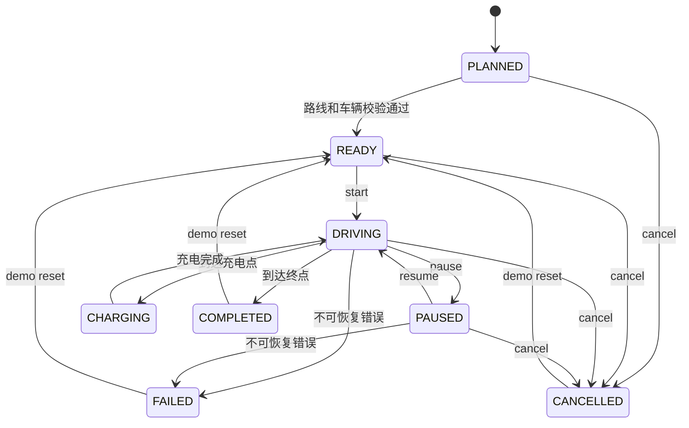
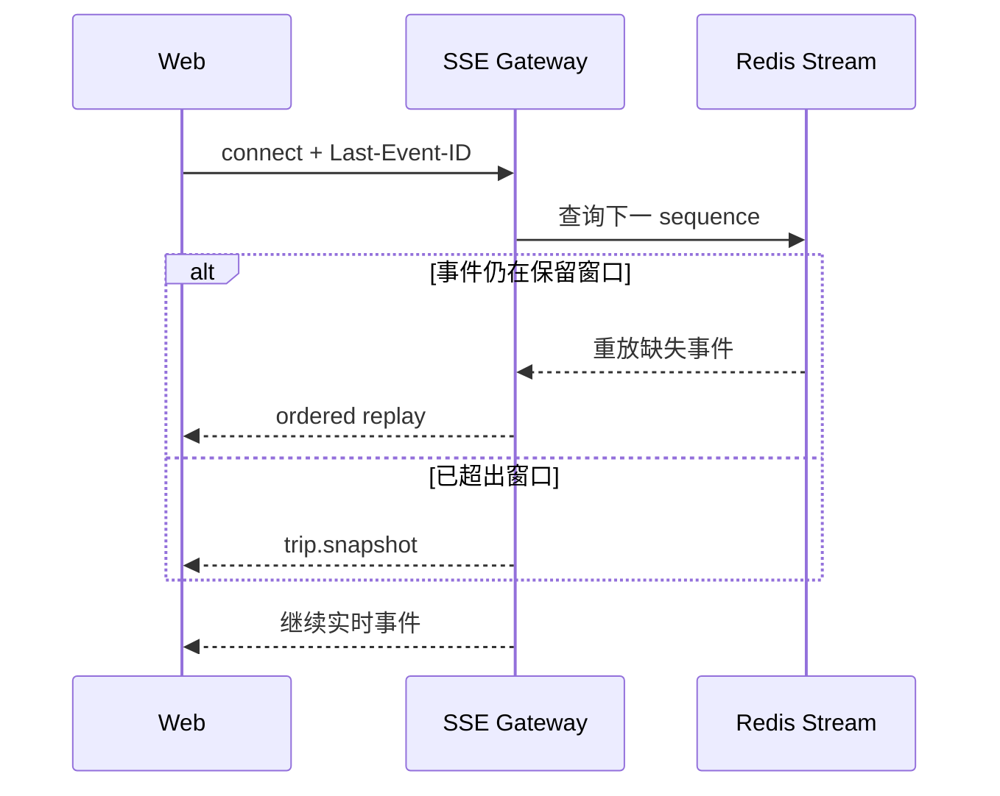

# RoadMind Agent 地图与行程模拟设计

> 文档状态：阶段 0 审查通过（开发基线）
> 地图提供商：高德地图 JS API 2.0（首选）
> 场景性质：真实地图与道路路线上的车辆数字孪生模拟

## 1. 目标与边界

“真实道路行进”在本项目中严格定义为：

```text
真实地图底图 + 真实道路规划路线 + 模拟车辆位置 + 模拟车辆遥测
```

它不代表真实车辆联网、真实车辆控制、实时 GPS 或厂商授权。地图页面、行程详情、SSE 快照和 README 必须持续显示 `SIMULATION` 或 `DIGITAL TWIN` 标识。

第一版重点：

- 二维或轻量 2.5D 道路地图；
- 沿道路的平滑位置推进；
- 可理解的车辆状态与 Agent 重规划；
- 稳定的暂停、继续、倍速和断线恢复。

第一版不实现 Three.js 城市、赛车玩法、高精地图、自动驾驶决策或真实导航播报。

## 2. 地图技术选型

### 2.1 高德地图 JS API 2.0

选择理由：

- 中国境内底图、驾车路线和 POI 能力完整；
- WebGL 渲染，支持点标记、折线、路况和轨迹相关能力；
- 提供 Vue 使用方式和 TypeScript 声明；
- 能满足二维/2.5D 智能座舱演示，不需要额外 3D 引擎。

官方文档：<https://lbs.amap.com/api/javascript-api-v2/summary>

### 2.2 提供商分工

| 能力 | 位置 | 说明 |
| --- | --- | --- |
| 地址解析/路线规划 | `roadmind-server` | 便于审计、能耗计算、模拟器使用和 Key 保密 |
| 地图底图/覆盖物渲染 | `roadmind-web` | 使用 JS API 2.0 |
| 车辆位置推进 | `vehicle-simulator` | 不依赖地图 SDK，只消费归一化路线 |
| 路线重规划协调 | `roadmind-server` | Agent、策略和行程状态统一判断 |
| 前端平滑插值 | `roadmind-web` | 解耦网络推送频率和渲染帧率 |

## 3. 地图适配层

前端业务组件不得直接到处调用 `AMap.*`。建议接口：

```ts
export interface MapProvider {
  mount(container: HTMLElement, options: MapMountOptions): Promise<void>
  destroy(): void
  setViewport(bounds: GeoBounds): void
  setFollowing(enabled: boolean): void
  onError(handler: (error: MapProviderError) => void): () => void
}

export interface RouteRenderer {
  render(route: RouteViewModel): void
  updateProgress(progress: RouteProgress): void
  replaceRoute(route: RouteViewModel): void
  clear(): void
}

export interface VehicleMarkerController {
  setPose(position: Coordinate, heading: number): void
  setState(state: VehicleMarkerState): void
  setVisible(visible: boolean): void
}

export interface MapCameraController {
  follow(position: Coordinate, heading: number): void
  fitRoute(route: Coordinate[]): void
  setFollowMode(enabled: boolean): void
}
```

实现类 `AmapMapProvider` 包装高德 SDK。降级实现 `FallbackMapProvider` 显示路线摘要、起终点、进度条和遥测列表，但不能伪装成真实地图。

## 4. 坐标与路线数据

### 4.1 坐标系

- 中国境内高德数据统一使用 GCJ-02。
- 内部坐标对象必须携带 `coordinateSystem`，防止 WGS84/GCJ-02 混用。
- 不对高德返回坐标重复转换。
- 用户上传或其他来源为 WGS84 时，只有 `CoordinateTransformer` 可以转换并记录来源。

```json
{
  "longitude": 118.7969,
  "latitude": 32.0603,
  "coordinateSystem": "GCJ-02"
}
```

### 4.2 内部路线结构

```json
{
  "routePlanId": "198000000000000501",
  "routeVersion": 1,
  "provider": "AMAP",
  "sourceMode": "LIVE",
  "providerRouteId": "provider-value-if-available",
  "coordinateSystem": "GCJ-02",
  "origin": {
    "name": "南京南站",
    "longitude": 118.7972,
    "latitude": 31.9689
  },
  "destination": {
    "name": "苏州站",
    "longitude": 120.6060,
    "latitude": 31.3290
  },
  "distanceMeters": 215400,
  "durationSeconds": 9300,
  "polyline": [
    {"longitude": 118.7972, "latitude": 31.9689},
    {"longitude": 118.8010, "latitude": 31.9701}
  ],
  "segments": [
    {
      "segmentIndex": 0,
      "roadName": "示例道路",
      "distanceMeters": 1200,
      "durationSeconds": 80,
      "speedLimitKmh": null,
      "polylineStartIndex": 0,
      "polylineEndIndex": 16
    }
  ],
  "chargingStations": [],
  "fetchedAt": "2026-08-03T12:00:00Z",
  "routeHash": "sha256..."
}
```

### 4.3 路线规范化

`RouteGateway` 完成：

1. 检查提供商状态码和字段完整性；
2. 过滤非有限数、越界经纬度和连续重复点；
3. 保留道路折点，不用高容差简化导致车辆“切弯”；
4. 计算每段相邻点的球面距离和累计距离；
5. 建立 `polylineIndex -> cumulativeDistanceMeters` 查找表；
6. 计算 `routeHash`，供重规划、缓存和幂等使用；
7. 以 `route_plan` 记录 `routePlanId`、版本、来源模式、归一化路线和有效期；行程通过 `current_route_plan_id` 指向当前版本；
8. 保存供应商原始响应的最小摘要，不长期保存不需要的字段，并遵守提供商缓存/展示条款。

`sourceMode` 只能是 `LIVE`、`CACHE` 或 `STUB`。真实高德调用、缓存结果和测试 Stub 必须在 API、日志和 UI 中可区分，不能把固定测试路线伪装成实时规划。

## 5. 行程状态机



约束：

- `reset` 只在 demo Profile 开放，恢复同一路线起点和初始模拟状态。
- `pause` 冻结模拟时钟、里程、电量和坐标，SSE 仍发送低频心跳。
- `cancel` 停止推进，不自动把已经执行的家居或预热操作回滚。
- `CHARGING` 只在充电策略明确插入站点后出现。
- 非法迁移返回 `409 TRIP_INVALID_TRANSITION` 并写审计。

## 6. 车辆位置推进算法

### 6.1 核心思想

模拟器不按“每次跳到下一个坐标点”推进，而是按模拟时间计算本 Tick 应前进的距离，再在路线累计距离表中定位。

每个 Tick：

```text
simulatedDeltaSeconds = realDeltaSeconds × simulationSpeed
distanceDeltaMeters = targetSpeedMps × simulatedDeltaSeconds
nextTravelledMeters = min(totalDistance, currentTravelled + distanceDelta)
```

然后：

1. 二分查找累计距离表，找到 `d[i] <= next < d[i+1]`；
2. 计算局部比例 `t = (next - d[i]) / (d[i+1] - d[i])`；
3. 在短路段内对经纬度做线性插值；
4. 计算新 heading；
5. 更新剩余距离、ETA、电量和状态；
6. 生成单调递增的遥测 `sequence`。

对于城市级短线段，局部线性插值足够；累计距离使用 Haversine 或高德提供的距离工具在服务端预计算。若连续点距离接近 0，跳过该段防止除零。

### 6.2 目标速度模型

首版使用可解释规则，不伪造真实驾驶模型：

```text
baseSpeed = min(segmentEstimatedSpeed, demoMaxSpeed)
targetSpeed = baseSpeed × weatherFactor × batteryFactor × eventFactor
```

建议：

- 无道路速度数据时，城市路段默认 40 km/h、高速特征路段默认 90 km/h；
- 起步和到达前使用缓入缓出，不瞬间从 0 到目标速度；
- 暂停/充电速度为 0；
- 速度值只用于演示和 ETA 模拟，UI 标注“模拟”。

## 7. Heading 计算

heading 表示从正北顺时针的角度，范围 `[0, 360)`。

对于前一点 `(lat1, lon1)` 和后一点 `(lat2, lon2)`，转为弧度后：

```text
y = sin(Δlon) × cos(lat2)
x = cos(lat1) × sin(lat2) - sin(lat1) × cos(lat2) × cos(Δlon)
bearing = atan2(y, x)
heading = (degrees(bearing) + 360) mod 360
```

处理规则：

- 两点距离小于阈值时沿用上次 heading；
- 转向跨越 0°/360° 时走最短角度插值；
- 可使用 3～5 个点的移动平均或低通滤波减少折线抖动；
- 地图图标素材的“默认朝向”必须记录，例如素材朝东时渲染角度需减 90°。

## 8. 前端平滑插值

SSE 建议 1 Hz，浏览器渲染通常 60 Hz。前端维护最近两个有效遥测点：

```text
previousTelemetry
nextTelemetry
receivedAt
expectedInterval
```

每帧使用 `requestAnimationFrame`：

1. `progress = clamp((now - receivedAt) / expectedInterval, 0, 1)`；
2. 对位置使用平滑函数（如 smoothstep）插值；
3. 对 heading 使用最短角差插值；
4. 电量、剩余距离和 ETA 使用线性或分段更新；
5. 新遥测到达时从当前渲染位置重新设为插值起点，避免回跳。

异常处理：

- 超过 3 个推送周期未收到新点：停止外推，显示“遥测延迟”；
- 不进行无限位置预测，避免车辆离开道路；
- 新点序号小于等于当前序号：丢弃；
- 距离突变超过合理阈值：先请求 `trip.snapshot`，不直接动画穿越地图；
- `PAUSED`、`CHARGING`、`FAILED` 时立即把目标速度设为 0。

## 9. SSE 遥测结构

```json
{
  "schemaVersion": 1,
  "eventId": "198000000000000601:128",
  "sequence": 128,
  "type": "trip.telemetry",
  "traceId": "01K2ROAD...",
  "tripId": "198000000000000601",
  "occurredAt": "2026-08-04T00:26:12.000Z",
  "data": {
    "coordinateSystem": "GCJ-02",
    "longitude": 119.2145,
    "latitude": 31.8421,
    "speedKmh": 82,
    "heading": 126,
    "batteryPercent": 31,
    "remainingRangeKm": 168,
    "remainingDistanceKm": 147,
    "estimatedArrivalTime": "2026-08-04T01:42:00Z",
    "tripStatus": "DRIVING",
    "simulationSpeed": 5,
    "routeVersion": 1
  }
}
```

### 9.1 事件顺序

- 每个 `tripId` 有独立单调序号。
- 状态事件与遥测共用同一序号域，保证顺序。
- 先持久化/写入 Redis Stream，再向连接发送。
- `eventId = tripId:sequence`，客户端不能只按全局字符串比较，需解析 sequence。

### 9.2 心跳与超时

- 正常遥测 1 Hz；高倍速仍保持 1 Hz 网络推送，单次推进更大模拟时间。
- 无业务事件时每 15 秒发心跳注释。
- 服务端连接空闲超时建议 30 分钟，行程完成后发送完成事件并关闭。
- 浏览器检测 30 秒无心跳或事件时重连。

## 10. 断线重连与事件去重

### 10.1 Redis Stream

每个行程建议使用：

```text
roadmind:trip:{tripId}:events
```

Stream Entry 包含 `eventId`、`sequence`、`type`、`traceId`、`occurredAt` 和 JSON data。使用最大长度近似裁剪，并另存最新安全快照。

### 10.2 重连流程



客户端 Store 保存 `lastAppliedSequence`：

- `sequence <= lastAppliedSequence`：忽略；
- `sequence == lastAppliedSequence + 1`：正常应用；
- 出现缺口：短暂缓冲并重连；仍缺失则请求快照；
- 收到快照：校验 `snapshotSequence` 后整体替换状态。

原生 `EventSource` 只会在同一连接的自动重连中自行携带 `Last-Event-ID`。页面刷新后的恢复先调用 `GET /api/v1/trips/{tripId}` 获取最新快照，再连接事件流；若实现 `afterSequence` 查询参数，服务端必须校验其为当前行程的非负序号。

## 11. 电量消耗模型

首版采用可解释的简化模型，所有参数在 demo 配置中可见：

```text
baseEnergyKWh = distanceKm × baseConsumptionKWhPer100Km / 100
energyKWh = baseEnergyKWh
          × temperatureFactor
          × speedFactor
          × trafficFactor
          + climateEnergyKWh
batteryDropPercent = energyKWh / usableBatteryCapacityKWh × 100
```

建议参数范围：

- 基础能耗：配置值，如 16.5 kWh/100km；
- 低温系数：低于 5°C 时逐步上升，设置上限；
- 速度系数：偏离经济速度时轻微增加；
- 空调能耗：按开启时长增加；
- 所有系数必须在配置和演示说明中标注“模拟参数”，不得称为真实车型数据。

每个 Tick 按本次行驶距离扣减电量，避免倍速改变总能耗。倍速只影响模拟时间，不改变路线距离和按距离计算的基础能耗。

## 12. 速度倍率

支持 `1x`、`5x`、`20x`：

- `simulationSpeed` 乘到模拟时间增量；
- 网络推送频率保持约 1 Hz；
- 位置推进、空调时长、ETA 和充电时长使用模拟时间；
- 原始路线距离、总能耗模型和事件顺序不因倍速改变；
- 切换倍率产生 `trip.simulation-speed.changed` 事件并写审计；
- 暂停期间倍率可修改，但直到继续后生效。

## 13. 低电量事件

### 13.1 触发条件

不能只看电量百分比，至少比较：

```text
availableRangeKm < remainingDistanceKm + reserveDistanceKm
```

同时设置硬阈值（例如电量低于配置值）作为演示故障触发器。实际值都属于模拟配置。

### 13.2 处理流程

1. 模拟器发布 `LOW_BATTERY` 遥测事件并保持原路线行驶或进入受控暂停，取决于配置。
2. `roadmind-server` 去重同一行程同一阈值事件。
3. Agent 使用当前位置、剩余路线和车辆状态调用 `charging.find_stations`。
4. `charging.calculate_strategy` 比较绕行距离、预计充电时间和安全余量。
5. 只读计算可自动进行；若新方案包含新的写操作，重新走 Policy Gate。
6. 生成新 `routeVersion`，成功后原子替换剩余路线。
7. 前端收到 `trip.route.updated` 后更新未行驶路线，不重绘已行驶轨迹。

## 14. 动态路线重新规划

### 14.1 触发源

- 低电量；
- 显式模拟道路事件；
- 天气变化导致能耗策略变化；
- 用户在多轮对话中修改终点；
- 路线提供商返回不可用或路线偏离。

### 14.2 一致性策略

- 以当前已确认位置为新路线起点；
- 行程进入 `REPLANNING` 子状态或发送独立进度事件，但主状态可保持 `PAUSED`/`DRIVING`；
- 新路线先校验坐标、距离和可达性，再增加 `routeVersion`；
- 更新数据库行程、Redis 快照和审计后再推送；
- 前端只接受更大的 `routeVersion`；
- 失败时保留旧路线并明确显示降级，不把直线连线冒充真实道路。

## 15. 地图镜头与视觉状态

### 15.1 跟车模式

- 默认启用跟车，但用户拖动地图后临时关闭，显示“恢复跟车”按钮。
- 跟随时平滑移动中心点，不在每个遥测点强制 `setCenter` 导致抖动。
- 低速城市路段使用较近缩放，高速可适度拉远；缩放变化节流。
- 重新规划时先展示新路线全览，再在短延迟后恢复跟车。

### 15.2 路线样式

- 已行驶路线：更亮/实色；
- 未行驶路线：较低对比度但清晰；
- 充电绕行：独立强调色；
- 失效旧路线：短暂虚化后移除；
- 起终点、充电站和车辆使用真实图标库或正式图片资产，不使用 emoji 或 CSS 图形冒充。

## 16. 地图不可用降级

触发条件：

- JS Key 或安全密钥未配置；
- SDK 加载超时；
- 域名白名单错误；
- 路线服务超时、限额或返回无效数据；
- 浏览器不支持必要能力。

降级页面必须保留：

- `SIMULATION` 标识；
- 起点、终点、总距离、预计时间；
- 车辆状态、当前道路名（若有）、剩余距离、ETA；
- 行程控制和 Agent 执行时间线；
- 明确错误原因和重试按钮。

若没有真实路线，不绘制“看起来像路线”的手工曲线或直线。可以显示“路线地图暂不可用”，并继续使用已有缓存路线做非地图的能耗/状态演示；缓存来源和时间必须可见。

## 17. 安全与 Key 管理

- 高德 Web 服务 Key 仅由 `roadmind-server` 环境变量读取。
- JS API Key 和安全密钥通过前端环境变量注入，并设置域名白名单和独立配额。
- 不把 Key 写入仓库、日志、SSE、错误详情或截图说明。
- 路线请求限制起终点数量、坐标范围、超时和调用频率。
- 提供商响应作为不可信数据校验，不能直接拼接到 Prompt 或 HTML。

## 18. 测试方案

### 18.1 算法测试

- 累计距离单调；
- 0 距离点处理；
- 区段二分定位；
- heading 的 0°/360° 边界；
- 暂停不推进；
- 倍速不改变总距离和按距离能耗；
- 到达终点不越界；
- 低电量事件只在阈值跨越时触发一次。

### 18.2 状态机测试

- 每个合法迁移；
- 非法迁移返回冲突；
- 并发 pause/cancel 只有一个成功；
- reset 仅 demo Profile 可用；
- 重新规划成功/失败都保持一致状态。

### 18.3 SSE 测试

- 序号、ID 和类型正确；
- 断线后完整重放；
- 重复事件去重；
- 超出窗口发送快照；
- 心跳和连接关闭；
- 行程完成后不再产生遥测。

### 18.4 前端测试

- 插值不瞬移；
- heading 最短角旋转；
- 跟车切换；
- 路线版本替换；
- 地图加载错误进入降级视图；
- SSE 延迟显示且停止无限外推。

## 19. 分阶段实现

- 阶段 1：模拟车辆静态状态和单字段修改，不做地图。
- 阶段 2：路线工具返回固定契约，SSE 推送基础 Agent 事件。
- 阶段 4：接高德真实路线、行程引擎、1 Hz 遥测、插值、控制、倍速和低电量重规划。
- 阶段 7：限流、熔断、外部故障与事件保留策略。
- 阶段 8：地图降级、断线和重规划进入自动评测与演示脚本。
